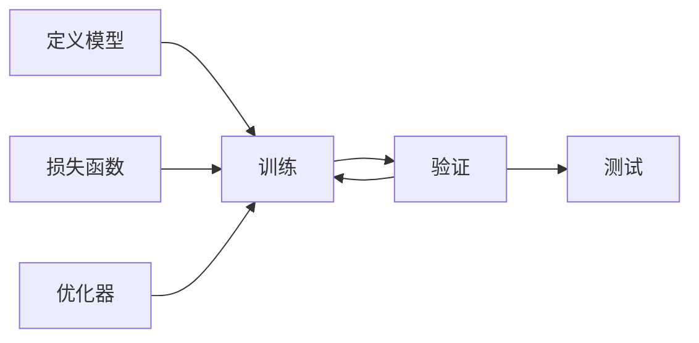

# PyTorch

训练模型的流程如下：

1. 定义模型
2. 定义损失函数和优化器
3. 迭代训练数据集，并进行前向传播、计算损失、反向传播和更新参数
4. 评估模型在验证数据集上的性能，直到达到预定的停止条件



## 数据加载

> PyTorch has two primitives to work with data: torch.utils.data.DataLoader and torch.utils.data.Dataset. **Dataset** **stores** the **samples** and their corresponding **labels**, and **DataLoader** wraps an **iterable** around the Dataset.

以下是一个简单的例子，展示如何使用 `torchvision.datasets.ImageFolder` 类从文件夹中加载图像数据集

```python
import torch
import torchvision
import torchvision.transforms as transforms

transform = transforms.Compose(
    [transforms.Resize((256, 256)),
     transforms.ToTensor()])

trainset = torchvision.datasets.ImageFolder(root='./data/train', transform=transform)
trainloader = torch.utils.data.DataLoader(trainset, batch_size=4, shuffle=True, num_workers=2)

testset = torchvision.datasets.ImageFolder(root='./data/test', transform=transform)
testloader = torch.utils.data.DataLoader(testset, batch_size=4, shuffle=False, num_workers=2)

classes = trainset.classes

for data, labels in trainloader:
    print(data.shape)
    print(labels)
```

在这个例子中，我们使用 `transforms` 模块定义了一个变换序列，它将图像调整为 256x256 大小并将它们转换为 PyTorch 张量。然后，我们使用 `ImageFolder` 类从本地文件夹中加载图像数据集。在这里，我们将训练集和测试集分别加载到 `trainset` 和 `testset` 变量中，并使用 `DataLoader` 创建数据加载器。最后，我们遍历训练集中的数据加载器，打印每个批次的张量形状和标签。

如果您需要从其他类型的文件中加载数据，您可以使用 `torch.utils.data.Dataset` 类创建自己的数据集，并实现 `__len__` 和 `__getitem__` 方法来加载数据。以下是一个简单的例子，展示如何从 CSV 文件中加载数据：

```python
import torch
from torch.utils.data import Dataset, DataLoader

class CustomDataset(Dataset):
    def __init__(self, csv_file):
        self.data = pd.read_csv(csv_file)

    def __len__(self):
        return len(self.data)

    def __getitem__(self, index):
        item = self.data.iloc[index]
        x = torch.tensor(item[:-1], dtype=torch.float32)
        y = torch.tensor(item[-1], dtype=torch.long)
        return x, y

dataset = CustomDataset('data.csv')
dataloader = DataLoader(dataset, batch_size=4, shuffle=True)

for data, labels in dataloader:
    print(data.shape)
    print(labels)
```

在这个例子中，我们定义了一个名为 `CustomDataset` 的自定义数据集类，它接受一个 CSV 文件名，并实现了 `__len__` 和 `__getitem__` 方法。然后我们创建了一个数据集实例，并使用 `DataLoader` 创建一个数据加载器，它将数据分成大小为 4 的批次，并在每个 epoch 中对数据进行随机重排。最后，我们遍历数据加载器，获取每个批次并打印它们。

## 定义模型

PyTorch 提供了一个基类 `torch.nn.Module`，它提供了模型的基本功能，例如将模型参数移动到 GPU、提供模型持久化的方法等。以下是一个简单的例子，展示了如何定义一个模型：

```python
print(f"Using {device} device")

# Define model
class NeuralNetwork(nn.Module):
    def __init__(self):
        super().__init__()
        self.flatten = nn.Flatten()
        self.linear_relu_stack = nn.Sequential(
            nn.Linear(28*28, 512),
            nn.ReLU(),
            nn.Linear(512, 512),
            nn.ReLU(),
            nn.Linear(512, 10)
        )

    def forward(self, x):
        x = self.flatten(x)
        logits = self.linear_relu_stack(x)
        return logits

```
创建设备
```python
device = (
    "cuda"
    if torch.cuda.is_available()
    else "mps"
    if torch.backends.mps.is_available()
    else "cpu"
)
print(f"Using {device} device")
```
将模型加载到设备上
```python
model = NeuralNetwork().to(device)
print(model)
```
>To use the model, we **pass it the input data**. This executes the model’s forward, along with some background operations. Do not call model.forward() directly!

>Calling the model on the input returns a 2-dimensional tensor with dim=0 corresponding to each output of 10 raw predicted values for each class, and dim=1 corresponding to the individual values of each output. We get the prediction probabilities by passing it through an instance of the nn.Softmax module.

```python
X = torch.rand(1, 28, 28, device=device)
logits = model(X)
pred_probab = nn.Softmax(dim=1)(logits)
y_pred = pred_probab.argmax(1)
print(f"Predicted class: {y_pred}")
```
### 发生了什么

```python
# 三张28*28的图片
input_image = torch.rand(3,28,28)
print(input_image.size())

flatten = nn.Flatten() # 展开层
# 将输入图像展平
flat_image = flatten(input_image)
print(flat_image.size())

# 线性层(全连接层)
layer1 = nn.Linear(in_features=28*28, out_features=20)
hidden1 = layer1(flat_image)
print(hidden1.size())

# 非线性层(激活函数)
print(f"Before ReLU: {hidden1}\n\n")
hidden1 = nn.ReLU()(hidden1)
print(f"After ReLU: {hidden1}")
```
以上的神经网络可以被表示为：
```python
seq_modules = nn.Sequential(
    flatten,
    layer1,
    nn.ReLU(),
    nn.Linear(20, 10)
)
input_image = torch.rand(3,28,28)
logits = seq_modules(input_image)
```
> The last linear layer of the neural network returns logits - raw values in [-infty, infty] - which are passed to the nn.Softmax module. The logits are scaled to values [0, 1] representing the model’s predicted probabilities for each class. dim parameter indicates the dimension along which the values must sum to 1.
```python
softmax = nn.Softmax(dim=1)
pred_probab = softmax(logits)
```


## 张量（Tensor）

张量（Tensor）是PyTorch中最重要的数据类型，它是一个多维数组。可以将它们看作是一个高维的矩阵。张量支持GPU加速，因此可以利用GPU进行高效的计算。以下是一些常用的操作：

```python
import torch

# 创建一个张量
x = torch.Tensor([[1, 2], [3, 4]])
print(x)

# 查看张量的形状
x.shape

```

## 自动求导（Autograd）

PyTorch的autograd包提供了自动求导的功能。通过设置`requires_grad=True`，可以让张量跟踪它的计算历史，并自动计算梯度。以下是一个简单的例子：

```python
import torch

# 创建一个张量，并设置requires_grad=True
x = torch.tensor([2.0, 3.0], requires_grad=True)

# 定义一个计算图，y = x^2 + 3x + 1
y = x ** 2 + 3 * x + 1

# 计算y对x的梯度
y.backward()

# 查看梯度
print(x.grad)
```

## 神经网络（Neural Networks）

PyTorch的`nn`包提供了一些常用的神经网络模块，例如全连接层、卷积层、循环神经网络等。以下是一个简单的例子：

```python 
import torch
import torch.nn as nn

# 定义一个全连接层
fc = nn.Linear(10, 5)

# 定义输入张量
x = torch.randn(1, 10)

# 前向传播
y = fc(x)

# 查看输出张量的形状
print(y.shape)
```

```python

```

## 损失函数（Loss Functions）

在深度学习中，我们通常需要使用损失函数来衡量模型的预测结果与真实标签之间的差距。PyTorch的`nn`包提供了一些常用的损失函数，例如均方误差损失函数、交叉熵损失函数等。以下是一个简单的例子：

```python
import torch
import torch.nn as nn

# 定义一个交叉熵损失函数
loss_fn = nn.CrossEntropyLoss()

# 定义输入张量和真实标签
x = torch.randn(1, 10)
y_true = torch.tensor([3])

# 计算损失
loss = loss_fn(x, y_true)

# 查看损失值
print(loss.item())
```

## 优化器（Optimizers）

在训练神经网络时，我们需要使用优化器来更新模型的参数，以便使损失函数最小化。PyTorch的`optim`包提供了一些常用的优化器，例如随机梯度下降（SGD）优化器、Adam优化器等。以下是一个简单的例子：

```python
import torch
import torch.nn as nn
import torch.optim as optim

# 定义一个全连接层和一个交叉熵损失函数
fc = nn.Linear(10, 5)
loss_fn = nn.CrossEntropyLoss()

# 定义输入张量和真实标签
x = torch.randn(1, 10)
y_true = torch.tensor([3])

# 定义优化器
optimizer = optim.SGD(fc.parameters(), lr=0.1)

# 计算损失和梯度，并更新参数
optimizer.zero_grad()
y_pred = fc(x)
loss = loss_fn(y_pred, y_true)
loss.backward()
optimizer.step()

# 查看更新后的参数
print(fc.weight)
```


## 训练模型


以下是一个简单的例子：

```python
import torch
import torch.nn as nn
import torch.optim as optim

# 定义模型
class Net(nn.Module):
    def __init__(self):
        super().__init__()
        self.fc = nn.Linear(10, 5)

    def forward(self, x):
        x = self.fc(x)
        return x

net = Net()

# 定义损失函数和优化器
loss_fn = nn.CrossEntropyLoss()
optimizer = optim.SGD(net.parameters(), lr=0.1)

# 定义训练数据集和验证数据集
train_data = torch.randn(100, 10)
train_labels = torch.randint(0, 5, (100,))
val_data = torch.randn(20, 10)
val_labels = torch.randint(0, 5, (20,))

# 训练模型
num_epochs = 10

for epoch in range(num_epochs):
    # 训练模型
    net.train()
    for i in range(len(train_data)):
        x = train_data[i]
        y_true = train_labels[i]

        optimizer.zero_grad()
        y_pred = net(x)
        loss = loss_fn(y_pred.unsqueeze(0), y_true.unsqueeze(0))
        loss.backward()
        optimizer.step()

    # 评估模型
    net.eval()
    val_loss = 0.0
    val_acc = 0.0
    with torch.no_grad():
        for i in range(len(val_data)):
            x = val_data[i]
            y_true = val_labels[i]

            y_pred = net(x)
            val_loss += loss_fn(y_pred.unsqueeze(0), y_true.unsqueeze(0)).item()
            val_acc += (y_pred.argmax() == y_true).float().item()

    val_loss /= len(val_data)
    val_acc /= len(val_data)

    print("Epoch [{}/{}], Val Loss: {:.4f}, Val Acc: {:.4f}"
          .format(epoch+1, num_epochs, val_loss, val_acc))
```

上述代码中，我们使用一个简单的全连接层作为模型，使用交叉熵损失函数和随机梯度下降优化器进行训练。训练过程中，我们将模型设置为训练模式（`net.train()`），然后迭代训练数据集，计算损失和梯度，并更新模型参数。训练完一轮后，我们将模型设置为评估模式（`net.eval()`），并在验证数据集上计算损失和准确率。

在训练过程中，我们还可以添加一些其他功能，例如学习率调度器、早停等，以优化模型的性能和训练效果。