## Unity中进行Compute Shader Profile 

使用`CommandBuffer`与`ProfilingSampler`进行Profile，`CommandBuffer`中的操作会被记录到`Profiler`中，`ProfilingSampler`可以用来标记`CommandBuffer`中的某一段操作，这样就可以在`UnityProfiler`中看到这段操作的耗时了

```C#
ProfilingSampler profiler = new ProfilingSampler("FFT Operation");
···
CommandBuffer cmd = new CommandBuffer();
cmd.name = "FFT Command Buffer";

...[other operation]...

using (new ProfilingScope(cmd, profiler))
{
    ...[operation of interest]...
}

...[other operation]...

Graphics.ExecuteCommandBuffer(cmd);
```

Profile Module 中选择 GPU，即可看到用时


建议在进行测试前重启一次Unity，这样测试时的结果会更加稳定

## 测试结果

因为单次FFT的执行时间有所波动

为了使得数据更加方便观察，每一帧进行 $20$ 次的 $FFT$ 与 $IFFT$ ，共 $40$ 次 `ARGBHalf` 四通道($\text{Complex32} \times 2$) 大小 $1024 \times 1024$ 的 $FFT$ 变换，不进行频域信号分离，显卡：`NVIDIA GeForce MX450`

| 组合     | 总用时(ms) | 拷贝用时(ms) | FFT Shader 用时(ms) | 平均FFT+IFFT用时(ms) | 平均单通道FFT用时(ms) |
| -------- | ---------- | ------------ | ------------------- | -------------------- | --------------------- |
| 空Shader | 1.150      | 0.420        | 0.730               | 0.037                | 0.005                 |
| 仅读写   | 13.114     | 0.410        | 12.704              | 0.635                | 0.079                 |
| R2       | 24.037     | 0.409        | 23.628              | 1.181                | 0.148                 |
| R4       | 17.974     | 0.425        | 17.549              | 0.877                | 0.110                 |
| R8+R2    | 18.433     | 0.420        | 18.013              | 0.901                | 0.113                 |
| R16+R4   | 53.338     | 0.407        | 52.931              | 2.647                | 0.331                 |
| R4*      | 17.431     | 0.408        | 17.023              | 0.851                | 0.106                 |
| R8*+R2   | 15.919     | 0.409        | 15.510              | 0.776                | 0.097                 |
| R16*+R4* | 16.034     | 0.409        | 15.625              | 0.781                | 0.098                 |
| R32      | 992.514    | 0.552        | 991.962             | 49.598               | 6.200                 |

```mermaid
gantt
    title Average FFT + IFFT Time (μs)
    dateFormat X
    axisFormat %s
    section Empty
    37   : 0, 37
    section Read Write
    635   : 0, 635
    section R2
    1181   : 0, 1181
    section R4
    877   : 0, 877
    section R8+R2
    901   : 0, 901
    section R16+R4
    2647    : 0, 1181
    section R4*
    851    : 0, 851
    section R8*+R2
    776    : 0, 776
    section R16*+R4*
    781    : 0, 781
```



至此已经差不多是优化的尽头了，最佳的`R8*+R2`组合平均用时 0.776 ms 而仅读写数据就平均需要 0.635 ms，目前的瓶颈是`RWTexture`与`group shared memory`间读写的开销


用表现最好$\text{Radix-8} \times 3 + \text{Radix-2}$ 计算，平均每张`ARGBHalf`大小`1024*1024`贴图的单次FFT时间为 `0.388ms`，平均每通道 `0.097ms` 


一个奇怪的现象，如果将

```hlsl
uint k = i / P;
uint p = i % P;
uint kP = k * P;
```

替换为在2的幂次下的位运算，或将`P`的值替换为`1<<log2_P`，这理论上会更快

```hlsl
uint k = i >> log2_P;
uint p = i & (P-1);
uint kP = k << log2_P;
```

但是，在Radix-4的优化版本中如此替换反而会使得计算时间骤增，这可能与编译器优化有关系。并且，Radix-2中如此替换也没得到性能提升


## 测试截图

shader空载


仅读写


$\text{Radix-2}$


$\text{Radix-4}$ 无细分


$\text{Radix-8} \times 3 + \text{Radix-2}$ 无细分


$\text{Radix-16} \times 2 + \text{Radix-4}$ 无细分


$\text{Radix-4}$ 优化


$\text{Radix-8} \times 3 + \text{Radix-2}$ Radix-8 使用3个Radix-2细分


$\text{Radix-16} \times 2 + \text{Radix-4}$ 


