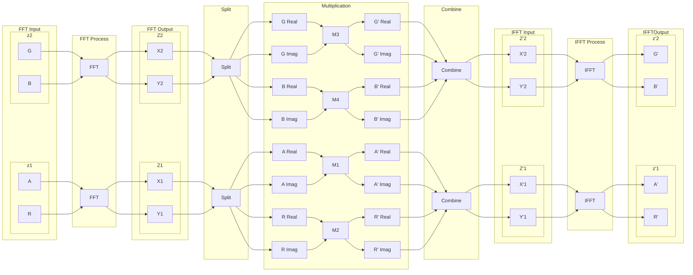
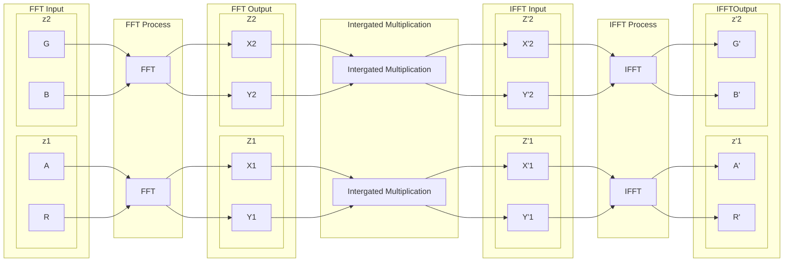
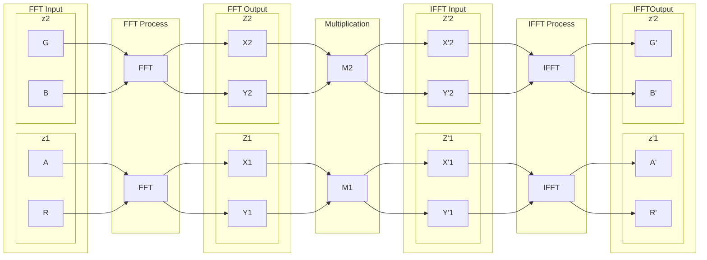

## 卷积泛光

### 卷积

卷积的定义如下

$$
\begin{align*}
f(x) * g(x) &= \int_{-\infty}^{\infty} f(\tau)g(x-\tau)d\tau\\
&= \int_{-\infty}^{\infty} f(x-\tau)g(\tau)d\tau
\end{align*}
$$

离散的情况下，卷积的定义如下

$$
\begin{align*}
f[n] * g[n] &= \sum_{m=-\infty}^{\infty} f[m]g[n-m]\\
&= \sum_{m=-\infty}^{\infty} f[n-m]g[m]
\end{align*}
$$

为什么傅里叶变换可以用来计算离散卷积呢，参见 [Convolution Theorem](https://ccrma.stanford.edu/~jos/sasp/Convolution_Theorem.html) 与 [Convolution Theorem DTFT](https://ccrma.stanford.edu/~jos/sasp/Convolution_Theorem_DTFT.html) 这里就不再赘述了

简单来说卷积与傅里叶变换的关系如下

$$
x*y = f^{-1}(f(x)\cdot f(y))
$$

### Real Number Convolution

在图像的FFT卷积过程中，其实完全不需要对 `RGBA` 四个通道分别进行四次卷积运算，

在前的 `Part 4 - FFT Optimization` 中提到对于实数的傅里叶变化，可以将两个实数信号复合为一个复数信号，这样就可以将实数信号的傅里叶变换转化为复数信号的傅里叶变换，这样就可以将实数信号的傅里叶变换的计算量减半

对于二维的实数信号，其复合与分离的方法如下

$$
\begin{align*}
&x[m,n],y[m,n] \in \mathbb{R}\\
z[m,n] &= x[m,n] + iy[m,n]\\
Z[k,l] &= DFT(z[m,n]) =  X[k,l] + iY[k,l]\\
X[k,l] &= \frac{1}{2}(Z[k,l] + Z^*[M-k,N-l])\\
Y[k,l] &= -\frac{1}{2i}(Z[k,l] - Z^*[M-k,N-l])\\
\end{align*}
$$

那么整个卷积的过程如下，这里只画出了一个图像FFT,另一个图像的FFT过程相同

这里看起来需要额外的一张8通道的贴图(两张四通道贴图)来存储中间结果，但是实际上可以将通道分离与混合过程合并到乘法运算过程中，这样就不需要额外的贴图了，而且还减少了显存的读写和程序的复杂度

当很愉快地按照这个思路写出了代码之后，却得到了错误的结果。这是因为在实数信号分离与合并中，会出现读写冲突，线程间的读写并不同步（Debug了很久才找出原因>_<）。

回到实数信号的复合与分离与合并的算法

$$
\begin{align*}
\text{ 1. } X[k,l] &= \frac{1}{2}(Z[k,l] + Z^*[M-k,N-l])\\
\text{ 2. } Y[k,l] &= -\frac{1}{2i}(Z[k,l] - Z^*[M-k,N-l])\\
\text{ 3. } Z[k,l] &=  X[k,l] + iY[k,l]
\end{align*}
$$

在信号分离过程中需要读取两个位置 $Z[k,l]$ 和 $Z[M-k,N-l]$，合并后写入 $Z[k,l]$，而对$Z[k,l]$ 和 $Z[M-k,N-l]$的运算往往不在同一线程组中，当下一个需要访问 $Z[M-k,N-l]$ 的运算执行时 $Z[k,l]$ 可能已经被修改了。

幸运的是，这个问题很容易解决，因为 $Z[k,l]$ 与 $Z[M-k,N-l]$ 是对称的，可以写出其对称的分离与合并公式

$$
\begin{align*}
\text{ 1. } X[M-k,N-l] &= \frac{1}{2}(Z[M-k,N-l] + Z^*[k,l])\\
\text{ 2. } Y[M-k,N-l] &= -\frac{1}{2i}(Z[M-k,N-l] - Z^*[k,l])\\
\text{ 3. } Z[M-k,N-l] &=  X[M-k,N-l] + iY[M-k,N-l]
\end{align*}
$$

这个对称的运算同样是读取 $Z[k,l]$ 和 $Z[M-k,N-l]$，合并后写入 $Z[M-k,N-l]$

只要在同一线程中执行这两个运算，即读取 $Z[k,l]$ 和 $Z[M-k,N-l]$ 后写入 $Z[k,l]$ 和 $Z[M-k,N-l]$，这样就可以避免读写冲突。

并且这个对称的运算可以减少一半读取次数，提高性能。

### Gray Scale Convolution

当需要进行卷积的其中一张图像的全部通道的数值相同时，或通道的数值两两相同时(以`ARGB`为例：`AR`通道数值相同，`GB`通道数值相同)，暂且也称之为灰度图 `Gray Scale Image`。

令

$$
U[k,l] = DTF(u[k,l])
$$

因为

$$
\begin{align*}
Z'[k,l] &=  X[k,l]U[k,l] + iY[k,l]U[k,l]\\
&= (X[k,l] + iY[k,l])U[k,l]\\
&= Z[k,l]U[k,l]
\end{align*}
$$

在乘法运算中，可以不进进行信号的分离与合并，而是直接对混合的复数信号进行乘法运算。这样可以极大减少中间的乘法和分离与合并运算量。(需要将灰度图中的作为虚部进行FFT的通道数值置零以得到等价结果)

### 半精度优化

使用点精度的浮点数进行图像的存储和运算会占用大量的内存和计算资源，而且在图像处理中，往往不需要高精度的运算，因此可以使用半精度的浮点数进行图像的存储和运算。

在原始的傅里叶变换中，使用半精度会出现精度不足的问题，因为图像转换为频域后出现了很多很小的数值，这些数值在半精度下会被截断为0，导致频域的信息丢失。

