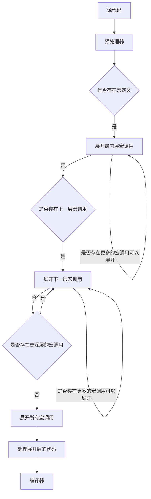

```cmake
add_compile_options( /Zc:__cplusplus /ZI )
add_compile_options( /JMC )

target_precompile_headers(Main 
PRIVATE "$<$<COMPILE_LANGUAGE:CXX>:Libraries/OpenGL.h>"
PRIVATE "$<$<COMPILE_LANGUAGE:CXX>:Libraries/Libs.h>")
```

