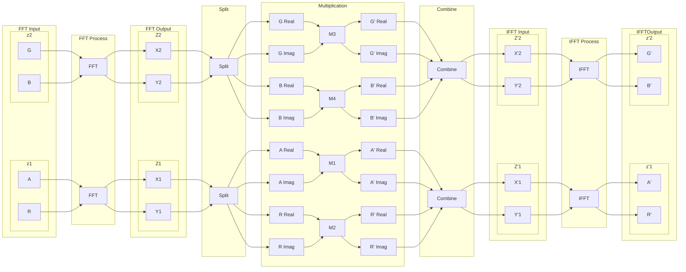
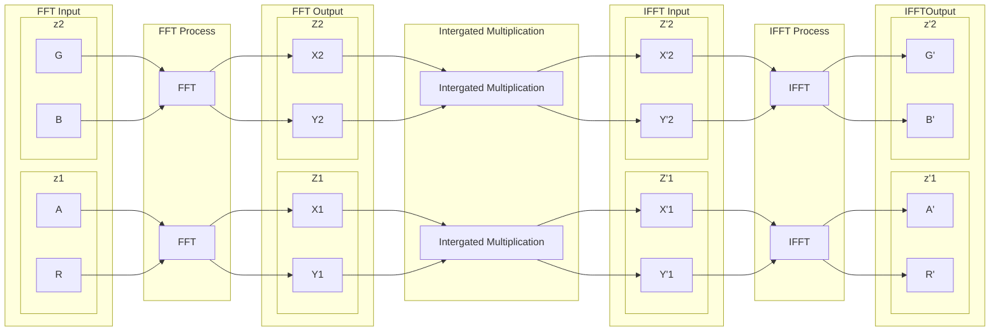
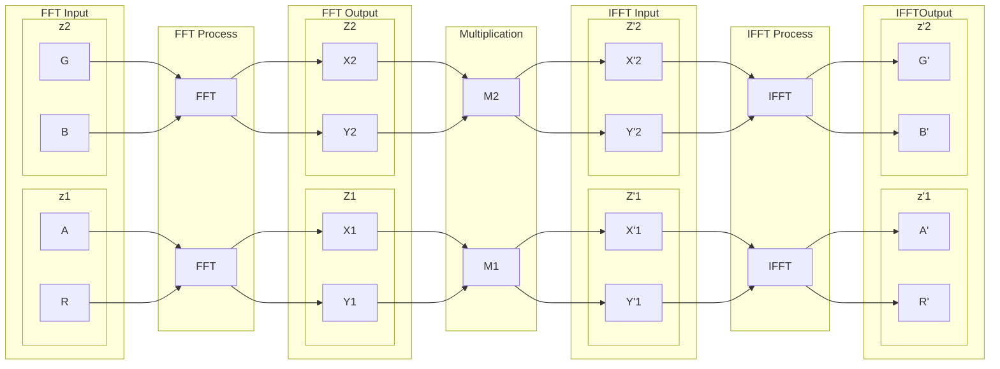

# 基于Radix-N FFT的泛光效果（草稿）

1. [基于Radix-N FFT的泛光效果（草稿）](#基于radix-n-fft的泛光效果草稿)
2. [绪论](#绪论)
   1. [研究背景](#研究背景)
      1. [卷积泛光](#卷积泛光)
      2. [Radix-N FFT](#radix-n-fft)
   2. [研究目的与意义](#研究目的与意义)
   3. [主要研究内容](#主要研究内容)
3. [关键技术分析](#关键技术分析)
   1. [离散傅里叶变换与快速傅里叶变换算法](#离散傅里叶变换与快速傅里叶变换算法)
      1. [FFT 的数据单点映射](#fft-的数据单点映射)
   2. [Radix-N FFT](#radix-n-fft-1)
      1. [Radix 组合间的映射函数](#radix-组合间的映射函数)
      2. [非二的整数幂的 Radix-N FFT](#非二的整数幂的-radix-n-fft)
      3. [Radix-N FFT 的分解策略](#radix-n-fft-的分解策略)
   3. [蝶形操作与 Radix-N FFT](#蝶形操作与-radix-n-fft)
      1. [蝶形公式](#蝶形公式)
      2. [嵌套的蝶形公式](#嵌套的蝶形公式)
   4. [实数 FFT](#实数-fft)
   5. [卷积泛光](#卷积泛光-1)
      1. [卷积](#卷积)
      2. [Real Number Convolution](#real-number-convolution)
      3. [Gray Scale Convolution](#gray-scale-convolution)
   6. [GPU 通用计算（GPGPU）](#gpu-通用计算gpgpu)
      1. [Compute Shader](#compute-shader)
      2. [GPU 存储器层级](#gpu-存储器层级)
4. [系统设计](#系统设计)
   1. [计算流](#计算流)
5. [参考文献](#参考文献)


# 绪论

## 研究背景

### 卷积泛光

泛光（Bloom）是现代实时渲染中常用的屏幕后处理效果之一，模拟了当光源非常明亮时，透过摄像头或人眼观察时的光晕现象，使高亮区域显得更耀眼。它广泛应用于游戏、电影和虚拟现实中，以增强视觉冲击力和真实感。

在图形学发展的早期，由于硬件性能的限制，光晕效果的应用极为有限。20世纪90年代，3D渲染技术刚刚起步，当时的图形硬件主要关注几何计算和基础的光照模型，缺乏对屏幕后处理的支持。即使是在高亮度场景中，视觉上的光晕效应很难被准确呈现，大多数渲染引擎无法直接处理光源的高亮溢出问题。
泛光渲染技术最早来源于摄影领域中的镜头效应。真实世界中，摄像机镜头观察高亮光源时，会产生光溢出或散射效应，即高亮光源的光晕扩散到周围区域。这个现象通过光学镜头的特性模拟被引入到了计算机图形学。20世纪末，游戏引擎开始通过手动绘制的方式模拟类似的镜头光晕效果。这种手工制作的纹理效果能产生一定的视觉感知，但不具备自适应的光溢出特性，仅在有限的场景中能营造出拟真的亮度效果。

在2000年代初，随着图形处理能力的提升，开发者逐渐尝试通过动态生成泛光效果来提高真实感。2000年代初，屏幕后处理技术逐渐被引入，包括了基于像素着色器的效果。这一时期，泛光效果开始出现在早期的游戏和渲染引擎中。

高斯模糊泛光：最早泛光实现方法之一是基于高斯模糊的卷积处理。开发者会将场景中的高亮区域提取出来，并对其进行高斯模糊，再将模糊后的图像与原图叠加。这种方式能有效模拟光源的溢出效果，但随着模糊半径的增大，计算开销显著增加，尤其在高分辨率下，对性能影响较大。

HDR 渲染与泛光效果的结合：同时，随着高动态范围渲染（HDR）技术的引入，泛光效果得到了进一步发展。HDR 渲染允许对场景中超出显示器标准亮度范围的光源进行更精确的处理。通过将超亮部分与泛光效果结合，开发者能够生成更加逼真的光晕现象，模拟现实世界中光源溢出的效果。

进入2010年代，随着 GPU 性能的爆发性增长，尤其是可编程管线和并行处理的兴起，泛光效果的实时渲染技术得到了显著的优化。游戏引擎开始普遍采用泛光渲染来提高场景的视觉质量。此时，泛光渲染技术变得更加高效和可控：

分级模糊技术：为了优化泛光渲染的性能，开发者引入了分级模糊（Mipmap-based Blur）技术。该方法通过对图像进行多次降采样，生成一系列不同分辨率的图像，再在较低分辨率图像上进行模糊处理并叠加，极大降低了计算量。这种技术广泛应用于实时渲染中，既提高了效率，又保留了效果的细腻度。

基于屏幕的亮度提取：此时的泛光实现更加注重对屏幕中高亮区域的提取和精细处理。使用亮度阈值方法，从场景中仅提取超过某个亮度值的像素点进行模糊处理，提升了视觉效果的自然感，同时减少了不必要的计算开销。

电影级别的泛光效果：在电影行业，泛光效果逐渐成为后期处理的重要部分，结合高质量的光照模型、体积光效应和动态模糊技术，使得泛光效果更具表现力。

随着对视觉效果要求的提升，尤其是 AAA 级游戏和电影的渲染需求不断提高，泛光技术也在朝着更加灵活、复杂的方向发展。GPU通用计算技术的应用让泛光效果得到了全新的发展：

传统的高斯模糊虽然简单易用，但效果单一，卷积泛光的引入使得开发者可以通过频域处理更加精确地控制光晕的形状和模式，实现不同于高斯模糊的自定义效果。

定制化泛光图案：基于 FFT 的泛光渲染技术，最大的优势在于它允许开发者灵活设计不同的光晕图案。通过在频域中设计特定的滤波器，可以生成更加复杂的光晕效果，如星形、十字形、甚至具有独特纹理的光晕，使得泛光效果在视觉上更加多样化和定制化。

### Radix-N FFT

图像卷积是图像处理中最基本的操作之一，用于实现各种滤波和效果处理。卷积操作通过将一个滤波器（也称为卷积核）作用在图像的每一个像素上，生成新的像素值，以实现模糊、锐化、边缘检测等效果。

然而，卷积在时域（图像的空间域）中的计算复杂度很高，特别是对于大尺寸的卷积核和高分辨率的图像。在这种情况下，直接在空间域进行卷积计算非常耗时，因此通常使用傅里叶变换将卷积转换为频域操作，显著提高计算效率。**离散傅里叶变换（DFT）**是其中的核心操作。DFT 将图像中每个像素的空间信息转换为其频率成分。通过这种变换，我们可以在频域中处理图像，进行更高效的卷积计算。


尽管在频域中，卷积通过简单的元素乘法来实现，但傅里叶变换本身的计算量非常庞大。直接计算二维 DFT 的复杂度是 \( O(N^2) \)，对于 \( N \times N \) 图像，复杂度达到 \( O(N^4) \)，这对于高分辨率图像和滤波器非常耗时。

为了应对这种计算量，通常采用快速傅里叶变换（FFT），将 DFT 的复杂度从 \( O(N^4) \) 降低到 \( O(N^2 \log N) \)。这极大地提高了大规模图像处理中的效率。

尽管频域卷积通过 FFT 优化了计算复杂度，但由于涉及的傅里叶变换本身仍然是一个计算密集型操作，尤其是对于高分辨率图像和多通道图像（如 RGB 图像），其计算量依然巨大。因此往往需要在 GPU 上实现快速傅里叶变换，以提高计算效率。

此外，在 GPU 上实现这些操作时，还需要仔细管理存储、同步以及数据传输等问题，确保充分利用硬件资源来提高性能。

Radix-2 快速傅里叶变换（FFT）是一种经典的 FFT 算法，用于高效计算离散傅里叶变换（DFT）。它基于分治法，将原问题拆分为规模更小的子问题，从而减少计算的复杂度。

尽管 Radix-2 FFT 是一种经典且高效的算法，它在实际应用中仍存在一些局限性和问题，尤其是在现代 GPU 或高性能计算环境下。主要问题如下

1. **必须是 2 的幂次**：
   - Radix-2 FFT 要求输入数据的长度 \( N \) 必须是 2 的幂次。如果输入数据的长度不是 2 的幂，则必须进行填充（如零填充），这会增加内存使用和计算负担。
   - 对于非 2 的幂次输入，填充可能导致额外的计算量，并且在某些情况下会引入误差或降低性能。

2. **同步操作多**：
   - 在并行计算中，Radix-2 FFT 需要频繁地进行线程间的同步，尤其是在每个蝶形运算（butterfly operation）之后。每次计算完一层 \( N/2 \) 规模的子问题后，所有线程必须等待彼此完成任务（`barrier`），然后继续下一步递归。
   - 频繁的同步会导致性能下降，特别是在现代 GPU 上，高代价的同步开销使得 Radix-2 FFT 在大规模并行环境下效率不高。

3. **存储访问模式复杂**：
   - Radix-2 FFT 涉及频繁的共享内存访问，且访问模式复杂，容易导致**非合并内存访问**（non-coalesced memory access），即多个线程对非连续内存地址的访问。这会增加内存带宽消耗，降低计算效率。

为了解决 Radix-2 FFT 的问题并进一步优化 FFT 的性能，现代高性能计算环境（尤其是 GPU 上）通常使用 Radix-N FFT。**Radix-N FFT** 是对 Radix-2 FFT 的推广，它将 DFT 分解为更大的基数 \( N \) 的子问题，从而减少递归深度和同步开销。

Radix-N FFT 的分解思想与 Radix-2 类似，但不是将问题拆分成两个子问题，而是拆分成 \( N \) 个子问题：

对于更大的基数，如 Radix-4、Radix-8，甚至 Radix-16，算法的分治结构依然适用，但递归深度显著减少。

Radix-N FFT 的优势如下

1. **减少同步操作**：
   - Radix-N FFT 中，每个线程可以在执行更多的计算步骤之前，不需要与其他线程同步。由于基数 \( N \) 的增加，递归深度减少了，每次分解之后线程独立计算的工作量更大，从而减少了同步点的数量。
   - 例如，在 Radix-4 FFT 中，同步的频率要远低于 Radix-2 FFT，因为每个线程处理的子问题规模增加，减少了线程间的数据依赖。

2. **更高的寄存器利用率**：
   - Radix-N FFT 中，基数越大，每个线程处理的数据块越多。这意味着寄存器使用率增加，能够更充分利用寄存器这种快速存储资源。通过将更多的中间计算结果保存在寄存器中，减少了对全局内存和共享内存的访问，从而提升了性能。

3. **减少内存带宽需求**：
   - 更大的基数 \( N \) 减少了递归深度和访问全局内存的次数。由于每个线程执行的计算量增大，并且在每次递归之后较少地交换数据，因此内存访问次数和频率减少，带宽需求随之降低。
   - 同时，较少的全局内存访问可以改善内存访问模式，尤其是减少非合并内存访问的发生，提升整体的内存访问效率。

4. **适应非 2 的幂的输入长度**：
   - Radix-N FFT 不要求输入数据的长度必须是 2 的幂次。通过选择合适的基数 \( N \)，可以避免输入数据长度不匹配带来的零填充开销。这对处理任意长度的输入数据非常有用，提高了算法的灵活性。

Radix-2 FFT 尽管是高效的离散傅里叶变换算法，但在现代并行计算环境下存在多种问题，如同步操作频繁、寄存器利用率低、非合并内存访问多等。为了解决这些问题，Radix-N FFT 通过选择更大的基数来减少递归深度、提高寄存器利用率、减少内存带宽需求，同时减少了线程间的同步操作。选择适当的基数（如 Radix-4、Radix-8 或更高）可以显著提高在 GPU 上的并行计算性能，因此在处理大规模 FFT 或高性能实时计算时，Radix-N FFT 是一个重要的优化策略。

## 研究目的与意义
本研究旨在探索利用 Radix-N FFT 优化泛光效果的可行性和性能提升空间，研究一种结合频域滤波的泛光效果实现方式。通过使用 Radix-N FFT 来替代传统FFT算法，期望能够减少大面积模糊效果的计算负载，同时保持或提高图像的视觉质量。

研究的意义在于：  
- **理论方面**：通过分析 Radix-N FFT 在图像处理中的应用潜力，提供一种新的泛光实现方法，为其他高效屏幕后处理算法的设计提供参考。
- **应用方面**：优化现有泛光效果的计算性能，尤其是在高分辨率和高帧率的场景下，让开发者能够更好地平衡视觉效果与计算资源消耗，进而提升用户的视觉体验。

## 主要研究内容
1. **Radix-N FFT 理论研究**  
   - 研究 Radix-N FFT 的基本原理、计算复杂度以及与其他 FFT 变种的比较。
   - 探讨其在GPU计算中的优势及其适用于泛光效果的可行性。

2. **泛光效果原理与现有实现方式**  
   - 总结当前常见的泛光效果实现方法，主要包括基于高斯模糊和卷积的方法。
   - 分析这些方法的优缺点，尤其是在实时渲染场景中的性能表现。

3. **Radix-N FFT 应用于泛光效果的方案设计**  
   - 将 Radix-N FFT 应用于泛光效果的详细设计，具体包括如何通过频域滤波实现光晕的模糊处理。
   - 探讨如何在 GPU 上高效实现 FFT 运算，以及如何与现有渲染管线结合。

4. **实验与性能评估**  
   - 搭建实验环境，测试 Radix-N FFT 泛光效果在不同分辨率和场景中的性能表现。
   - 将 Radix-N FFT 方案与传统泛光实现进行对比，评估其在性能和视觉效果上的优势。

# 关键技术分析

## 离散傅里叶变换与快速傅里叶变换算法

首先，离散傅里叶逆变换为

$$
x[n] = \frac{1}{N}\sum_{k=0}^{N-1}X[k]e^{i2\pi kn/N}
$$

离散傅里叶变换为

$$
X[k] = \sum_{n=0}^{N-1}x[n]e^{-i2\pi kn/N}
$$

引入单位根

$$
\omega_N = e^{i2\pi/N}
$$

$$
\omega_N^k = e^{i2\pi k/N}
$$

有

$$
x[n] = \frac{1}{N}\sum_{k=0}^{N-1}X[k]\omega_N^{kn}
$$

$$
X[k] = \sum_{n=0}^{N-1}x[n]\omega_N^{-kn}
$$

FFT是DFT的一种快速计算方法，它的时间复杂度为$O(N\log N)$，而DFT的时间复杂度为$O(N^2)$，FFT的时间复杂度比DFT的时间复杂度低了一个数量级，这是非常可观的。

FFT 的核心思想是将 DFT 分解为多个重叠的子问题，然后将这些子问题的结果合并起来，得到最终的结果

$$
\begin{align*}
X[k] &= \sum_{n=0}^{N-1}x[n]\omega_N^{-kn}\\
&= \sum_{n=0}^{N/2-1}x[2n]\omega_N^{-k(2n)} + \omega_N^k\sum_{n=0}^{N/2-1}x[2n+1]\omega_N^{-k(2n+1)}\\
&= \sum_{n=0}^{N/2-1}x[2n]\omega_{N/2}^{-kn} + \omega_N^k\sum_{n=0}^{N/2-1}x[2n+1]\omega_{N/2}^{-kn}\\
\end{align*}
$$

为方便起见一般记 

$$\omega^{-x} = W^{x}$$


### FFT 的数据单点映射

最为经典的 FFT 算法是 Cooley-Tukey 算法，它将 DFT 分解为两个长度为 $N/2$ 的 DFT，然后将这两个 DFT 的结果合并起来，得到最终的结果


从后向前看，每一层的运算都是将 $N$ 个点分成两组，对于索引来说，这是做了一次逆均匀洗牌 $S^{-1}$ 即二进制中最低位变成最高位，每一次都进行这样的操作，共进行 $\log_2 N$ 逆均匀洗牌，最后得到的结果就是第一次的编号变成了二进制逆序位，在读入数据时，需要先进行逆序位映射处理，Cooley-Tukey 算法的最终数据映射如下图所示


那么有没有不需要进行逆序位映射的方法呢？

如果试着把各层索引进行排序，可以最终得到这样的映射


这样就可以免去逆序位映射这一步操作了，但是相应的代价是需要两倍的空间，因为每一层的一组运算不再是写入到同一组的位置，而是写入到另一组的位置，这样就需要两倍的空间来存储数据。

我们将 FFT 的递推公式展开，可以得到

$$
\begin{align*}
X[k] 
&= \sum_{n=0}^{N/2-1}x[2n]W_{N/2}^{nk} + W_N^k\sum_{n=0}^{N/2-1}x[2n+1]W_{N/2}^{nk}\\
&= \sum_{n=0}^{N/4-1}x[4n]W_{N/4}^{nk} + W_N^k\sum_{n=0}^{N/4-1}x[4n+2]W_{N/4}^{nk} \\&+ W_N^k\left( \sum_{n=0}^{N/4-1}x[4n+1]W_{N/4}^{nk} + W_N^k\sum_{n=0}^{N/4-1}x[4n+3]W_{N/4}^{nk} \right)\\
\end{align*}
$$

进行一次 FFT 共需要 $L=\log_2N$ 层并行运算，每一层都是将 $N$ 个点分成两组，然后将这两组点合并成一个 $N/2$ 点的DFT

将第 $l$ 层的 $N$ 长度的向量表示为 $X_{N/2^{L-l}}$，那么 $L$ 层为 $X_{N}$ ，第 $L-1$ 层为 $X_{N/2}$, ……，第 $0$ 层为 $X_{N/N} = x$

这里的 $X_{N/2}$ 并不是长度为 $N/2$ 的向量，$X_{N/2}$ 的长度依然为 $N$ 

这里引入循环数组 $X[k+N]=X[k]$ 因为在傅里叶变换中，数值是周期延拓的，只要在最后进行取模运算即可

根据上面展开的公式，可以得到
在第$\log_2N$ 层的映射关系

$$
X_N[k]= X_{N/2}[2k] + W_N^kX_{N/2}[2k+1]
$$

根据 FFT 的递推公式

$$
X[k] = \sum_{n=0}^{N/2-1}x[2n]W_{N/2}^{nk} + W_N^k\sum_{n=0}^{N/2-1}x[2n+1]W_{N/2}^{nk}
$$

将 $2k$ 中的 $k$ 换元为 $2k$ 与 $2k + 1$ 

得到在第$L-1$ 层的映射关系

$$
\begin{align*}
X_{N/2}[2k] &= X_{N/4}[4k] + W_{N/2}^{k}X_{N/4}[4k+2]\\
X_{N/2}[2k+1] &= X_{N/4}[4k+1] + W_{N/2}^{k}X_{N/4}[4k+3]\\
\end{align*}
$$

将这两个公式翻译一下即：给定在数组 $X_{N/2}$ 中的编号 $k$ , 欲求得 $X_{N/2}[2k]$ ，则需寻 $X_{N/4}$ 中 $4k$ 与 $4k+2$ 的值 ……

再将两条公式合并得到一条公式
先将公式写为分段函数的形式，这里需要将原式中的 $k$ 均换元为 $k'$ 然后分别令 $2k = k'$ $2k+1=k'$ 得到

$$
X_{N/2}[k] = \begin{cases}
X_{N/4}[2k]   + W^{k/2}_{N/2}X_{N/4}[2k+2] & k \text{ mod } 2 = 0\\
X_{N/4}[2k-1] + W^{(k-1)/2}_{N/2}X_{N/4}[2k+1] & k \text{ mod } 2 = 1\\
\end{cases}
$$

再进行合并

$$
X_{N/2}[k] = 
X_{N/4}[2k - k \text{ mod } 2] 
+W^{k-k \text{ mod } 2}_{N/2}
X_{N/4}[2k + 2 - k \text{ mod } 2]
$$

继续递推

$$
\begin{align*}
X_{N/4}[4k]   &= X_{N/8}[8k]   &+ W^{k}_{N/4}X_{N/8}[8k+4]\\
X_{N/4}[4k+1] &= X_{N/8}[8k+1] &+ W^{k}_{N/4}X_{N/8}[8k+5]\\
X_{N/4}[4k+2] &= X_{N/8}[8k+2] &+ W^{k}_{N/4}X_{N/8}[8k+6]\\
X_{N/4}[4k+3] &= X_{N/8}[8k+3] &+ W^{k}_{N/4}X_{N/8}[8k+7]\\
\end{align*}
$$

写为分段函数

$$
X_{N/4}[k] = \begin{cases}
X_{N/8}[2k]   + W^{(k  )/4}_{N/4}X_{N/8}[2k+4] & k \text{ mod } 4 = 0\\
X_{N/8}[2k-1] + W^{(k-1)/4}_{N/4}X_{N/8}[2k+3] & k \text{ mod } 4 = 1\\
X_{N/8}[2k-2] + W^{(k-2)/4}_{N/4}X_{N/8}[2k+2] & k \text{ mod } 4 = 2\\
X_{N/8}[2k-3] + W^{(k-3)/4}_{N/4}X_{N/8}[2k+1] & k \text{ mod } 4 = 3\\
\end{cases}
$$

合并

$$
X_{N/4}[k] = 
X_{N/8}[2k - k \text{ mod } 4] + 
W^{(k-k \text{ mod } 4)/4}_{N/4}
X_{N/8}[2k + 4 - k \text{ mod } 4]
$$

最后可以总结出一般的映射公式

记 $\overline{l} = L- l$ , $\overline{l} \in\{ 0,1 ,\cdots,L-1\}$

$$
X_{N/2^{\overline{l}}}[k] = 
X_{N/2^{\overline{l}+1}}[2k - k \text{ mod } 2^{\overline{l}}] 
+W^{(k-k \text{ mod } 2^{\overline{l}})/2^{\overline{l}}}_{N/2^{\overline{l}}}
X_{N/2^{\overline{l}+1}}[2k + 2^{\overline{l}} - k \text{ mod } 2^{\overline{l}}]
$$

鉴于 $X_{N/2^{\overline{l}}}$ 的表述方式过于复杂，且实际计算中也不会出现，记 $X_{N/2^{\overline{l}}}$ 为 $X_{l}$ , 表示在第 $l$ 次 FFT 运算中的写入对象

此外 $$W^{(k-k \text{ mod } 2^{\overline{l}})/2^{\overline{l}}}_{N/2^{\overline{l}}}$$ 可以简化为 $$W^{k-k \text{ mod } 2^{\overline{l}}}_{N}$$

上述公式可以简化为

$$
X_{l}[k] = X_{l-1}[2k - k \text{ mod } 2^{\overline{l}}] 
+W^{k-k \text{ mod } 2^{\overline{l}}}_{N}
X_{l-1}[2k + 2^{\overline{l}} - k \text{ mod } 2^{\overline{l}}]
$$

最后进行取模，从循环数组转换到实际计算中的数组

$$
X_{l}[k] = X_{l-1}[(2k - k \text{ mod } 2^{\overline{l}})\text{ mod }N] 
+W^{k-k \text{ mod } 2^{\overline{l}}}_{N/2^{\overline{l}}}
X_{l-1}[(2k + 2^{\overline{l}} - k \text{ mod } 2^{\overline{l}})\text{ mod }N]
$$

其中 $2k - k \text{ mod } 2^{\overline{l}}$ 还有另一种形式的表述

利用 $m \text{ mod } n = m - n \lfloor \frac{m}{n} \rfloor$

$$
\begin{align*}
2k - k\text{ mod } 2^{\overline{l}} &= 2k - (k - 2^{\overline{l}}\lfloor \frac{k}{2^{\overline{l}}} \rfloor)\\
&= 2^{\overline{l}}\lfloor \frac{k}{2^{\overline{l}}} \rfloor + k\\
\end{align*}
$$

在实际的计算中是两次移位运算、一次加法运算，相较 $2k - k \text{ mod } 2^{\overline{l}}$ (一次移位运行、两次加法运算、一次与运算) 更快

同理 $k - k\text{ mod } 2^{\overline{l}} $ 也可以写为
$$
\begin{align*}
k - k\text{ mod } 2^{\overline{l}} 
&= 2^{\overline{l}}\lfloor \frac{k}{2^{\overline{l}}} \rfloor\\
\end{align*}
$$

## Radix-N FFT

一般的 FFT 算法是将 DFT 分解成两个 DFT，然后再将这两个 DFT 分解成两个 DFT，以此类推，直到分解成两个点的 DFT，然后再将这两个点的 DFT 合并成一个两点的 DFT，以此类推，直到合并成一个 N 点的 DFT。

$$
\begin{align*}
X[k] &= \sum_{n=0}^{N-1}x[n]W_N^{nk}\\
&= \sum_{n=0}^{N/2-1}x[2n]W_N^{2nk} + \sum_{n=0}^{N/2-1}x[2n+1]W_N^{(2n+1)k}\\
&= \sum_{n=0}^{N/2-1}x[2n]W_{N/2}^{nk} + W_N^k\sum_{n=0}^{N/2-1}x[2n+1]W_{N/2}^{nk}\\
&= X_e[k] + W_N^kX_o[k]\\
\end{align*}
$$

为了减少FFT中内存读写的次数，我们将其分成4组 (4点DTF)

$$
\begin{align*}
X[k] &= \sum_{n=0}^{N-1}x[n]W_N^{nk}\\
&= \sum_{n=0}^{N/4-1}x[4n]W_N^{4nk} + \sum_{n=0}^{N/4-1}x[4n+1]W_N^{(4n+1)k} + \sum_{n=0}^{N/4-1}x[4n+2]W_N^{(4n+2)k} + \sum_{n=0}^{N/4-1}x[4n+3]W_N^{(4n+3)k}\\
&=\sum_{n=0}^{N/4-1}x[4n]W_{N/4}^{nk} + W_N^k\sum_{n=0}^{N/4-1}x[4n+1]W_{N/4}^{nk} + W_N^{2k}\sum_{n=0}^{N/4-1}x[4n+2]W_{N/4}^{nk} + W_N^{3k}\sum_{n=0}^{N/4-1}x[4n+3]W_{N/4}^{nk}\\
&= X_{N/4}[4k] + W_N^kX_{N/4}[4k+1] + W_N^{2k}X_{N/4}[4k+2] + W_N^{3k}X_{N/4}[4k+3]\\
\end{align*}
$$

这等价于将 Radix-2 公式展开一层

$$
\begin{align*}
X[k] 
&= \sum_{n=0}^{N/2-1}x[2n]W_{N/2}^{nk} + W^k_N\sum_{n=0}^{N/2-1}x[2n+1]W_{N/2}^{nk}\\
&= X_{N/2}[2k] + W^k_NX_{N/2}[2k+1]\\
&= X_{N/4}[4k] + W^k_{N/2}X_{N/4}[4k+2] + W^k_N(X_{N/4}[4k+1] + W^k_{N/2}X_{N/4}[4k+3])\\
&= X_{N/4}[4k] + W^{2k}_{N}X_{N/4}[4k+2] + W^k_N( X_{N/4}[4k+1] + W^{2k}_{N}X_{N/4}[4k+3])\\
&= X_{N/4}[4k] + W_N^kX_{N/4}[4k+1] + W_N^{2k}X_{N/4}[4k+2] + W_N^{3k}X_{N/4}[4k+3]\\
\end{align*}
$$

这样我们就得到 Radix-4 的 FFT 算法，在最大并行度下，算法的时间复杂度为 $O(N\log_4N)$，比一般的 FFT 算法的时间复杂度 $O(N\log_2N)$ 要小。

现在我们来推导 Radix-4 FFT 的映射公式

记函数 
$$
f^{k}_N(x_0, x_1, \cdots, x_{R-1}) = \sum_{r=0}^{R-1}x_rW_N^{rk}
$$

第 $L$ 层的第 $k$ 个点的映射公式为

$$
\begin{align*}
X_{N}[k] &= f^k_{N}(X_{N/4}[4k], X_{N/4}[4k+1], X_{N/4}[4k+2], X_{N/4}[4k+3])\\
\end{align*}
$$

将 $k$ 换元为 $4k$、$4k+1$、$4k+2$、$4k+3$，得到

$$
\begin{align*}
X_{N/4}[4k] &=   f^{k}_{N/4}(X_{N/16}[16k],   &X_{N/16}[16k+4], &X_{N/16}[16k+8],  &X_{N/16}[16k+12])\\
X_{N/4}[4k+1] &= f^{k}_{N/4}(X_{N/16}[16k+1], &X_{N/16}[16k+5], &X_{N/16}[16k+9],  &X_{N/16}[16k+13])\\
X_{N/4}[4k+2] &= f^{k}_{N/4}(X_{N/16}[16k+2], &X_{N/16}[16k+6], &X_{N/16}[16k+10], &X_{N/16}[16k+14])\\
X_{N/4}[4k+3] &= f^{k}_{N/4}(X_{N/16}[16k+3], &X_{N/16}[16k+7], &X_{N/16}[16k+11], &X_{N/16}[16k+15])\\
\end{align*}
$$

与Radix-2 FFT推导类似
写成分段函数的形式

$$
X_{N/4}[k] = \begin{cases}
f^{k}_{N/4}(X_{N/16}[4k],   &X_{N/16}[4k+4], &X_{N/16}[4k+8],  &X_{N/16}[4k+12]) & k \text{ mod } 4 = 0\\
f^{k}_{N/4}(X_{N/16}[4k-3], &X_{N/16}[4k+1], &X_{N/16}[4k+5],  &X_{N/16}[4k+9]) & k \text{ mod } 4 = 1\\
f^{k}_{N/4}(X_{N/16}[4k-6], &X_{N/16}[4k-2], &X_{N/16}[4k+2],  &X_{N/16}[4k+6]) & k \text{ mod } 4 = 2\\
f^{k}_{N/4}(X_{N/16}[4k-9], &X_{N/16}[4k-5], &X_{N/16}[4k-1],  &X_{N/16}[4k+3]) & k \text{ mod } 4 = 3\\
\end{cases}
$$

(这里犯了过一个经验主义错误，不进行分段函数的展开就直接按照Radix-2的规律写，导致花费了大量的Debug时间才定位到公式推导的错误)

$$
X_{N/4}[k] = f^{(k - k \text{ mod } 4)/4}_{N/4}
\begin{pmatrix}
X_{N/16}[4k +0- 3(k \text{ mod } 4)],\\
X_{N/16}[4k +4- 3(k \text{ mod } 4)],\\
X_{N/16}[4k +8- 3(k \text{ mod } 4)],\\
X_{N/16}[4k +12- 3(k \text{ mod } 4)]\\
\end{pmatrix}
$$

(因为参数过长所以竖着写)


继续推导

$$
16\begin{cases}
X_{N/16}[16k] &=  f^{k}_{N/16}(X_{N/64}[64k],   &X_{N/64}[64k+16], &X_{N/64}[64k+32],  &X_{N/64}[64k+48])\\
\cdots\\
X_{N/16}[16k+4] &=f^{k}_{N/16}(X_{N/64}[64k+4], &X_{N/64}[64k+20], &X_{N/64}[64k+36],  &X_{N/64}[64k+52])\\
\cdots\\
X_{N/16}[16k+8] &=f^{k}_{N/16}(X_{N/64}[64k+8], &X_{N/64}[64k+24], &X_{N/64}[64k+40],  &X_{N/64}[64k+56])\\
\cdots\\
X_{N/16}[16k+12]&=f^{k}_{N/16}(X_{N/64}[64k+12],&X_{N/64}[64k+28],&X_{N/64}[64k+44], &X_{N/64}[64k+60])\\
\cdots\\
\end{cases}
$$

写成分段函数的形式

$$
X_{N/16}[k] = \begin{cases}
f^{k}_{N/16}(X_{N/64}[4 k],&X_{N/64}[4 k + 16],&X_{N/64}[4 k + 32],&X_{N/64}[4 k + 48]) & k \text{ mod } 16 = 0\\
\cdots\\
f^{k}_{N/16}(X_{N/64}[4 k - 12],&X_{N/64}[4 k + 4],&X_{N/64}[4 k + 20],&X_{N/64}[4 k + 36]) & k \text{ mod } 16 = 0\\
\cdots\\
f^{k}_{N/16}(X_{N/64}[4 k - 24],&X_{N/64}[4 k - 8],&X_{N/64}[4 k + 8],&X_{N/64}[4 k + 24]) & k \text{ mod } 16 = 0\\
\cdots\\
f^{k}_{N/16}(X_{N/64}[4 k - 36],&X_{N/64}[4 k - 20],&X_{N/64}[4 k - 4],&X_{N/64}[4 k + 12]) & k \text{ mod } 16 = 0\\
\cdots\\
\end{cases}
$$

$$
X_{N/16}[k] = f^{(k-k \text{ mod } 16)/16}_{N/16}
\begin{pmatrix}
X_{N/64}[4k +0- 3(k \text{ mod } 16)],\\
X_{N/64}[4k +16- 3(k \text{ mod } 16)],\\
X_{N/64}[4k +32- 3(k \text{ mod } 16)],\\
X_{N/64}[4k +48- 3(k \text{ mod } 16)]\\
\end{pmatrix}
$$

总结得到 Radix-4 的映射公式

记 $\overline{l} = L- l$ , $\overline{l} =\{ L, L-1,\cdots,0\}$
$$
X_{N/4^{\overline{l}}}[k] = f^{(k-k \text{ mod } 4^{\overline{l}})/4^{\overline{l}}}_{N/4^{\overline{l}}}
\begin{pmatrix}
X_{N/4^{\overline{l}+1}}[4k                        - 3(k \text{ mod } 4^{\overline{l}})],\\
X_{N/4^{\overline{l}+1}}[4k+4^{\overline{l}}       - 3(k \text{ mod } 4^{\overline{l}})],\\
X_{N/4^{\overline{l}+1}}[4k+2\cdot4^{\overline{l}} - 3(k \text{ mod } 4^{\overline{l}})],\\
X_{N/4^{\overline{l}+1}}[4k+3\cdot4^{\overline{l}} - 3(k \text{ mod } 4^{\overline{l}})]
\end{pmatrix}
$$

我们可以继续推导 Radix-8、Radix-16 …… 的映射公式
但是 Radix-4 以上的公式太长了，不方便显示，生成分段函数的代码如下

```py
import sympy as sp
k = sp.Symbol('k', integer=True)
R = 8
S = 1
R_S = R**S
gap = 1
print_latex = False
if print_latex: print(f'X_{{N/{R_S}}}[k] = \\begin{{cases}}')
for r in range(0,R_S,gap):
    a = R_S*R*(k-r)/R_S
    b = [a + r + R_S*i for i in range(R)]
    for i in range(R):
        b[i] = sp.latex(sp.simplify(b[i]))
    if print_latex : 
        
        print(f'f^{{k}}_{{N/{R_S}}}(')
        for i in range(R):
            print(f'&X_{{N/{R_S*R}}}[{b[i]}]',end='')
        print(f') & k \\text{{ mod }} {R_S} = 0 \\\\ ')
        if gap != 1: 
            print('\\cdots')
    else:
        print(b)
if print_latex: print('\\end{cases}')
```

根据以上可以再总结出 Radix-R 的映射公式 (N已经使用了)

$$
\begin{align*}
X_{N/R^{\overline{l}}}[k] = f^{(k-k \text{ mod } R^{\overline{l}})/R^{\overline{l}}}_{N/R^{\overline{l}}}
\begin{pmatrix}
X_{N/R^{\overline{l}+1}}[Rk                             - (R-1)(k \text{ mod } R^{\overline{l}})],\\
X_{N/R^{\overline{l}+1}}[Rk+R^{\overline{l}}            - (R-1)(k \text{ mod } R^{\overline{l}})],\\
\cdots\\
X_{N/R^{\overline{l}+1}}[Rk+(R-1)\cdot R^{\overline{l}} - (R-1)(k \text{ mod } R^{\overline{l}})]
\end{pmatrix}
\end{align*}
$$

将 $X_{N/R^{\overline{l}}}$ 记为 $X_l$ 表示在第 $l$ 次 FFT 运算中的写入对象，并记 $r$ 为第 $r$ 个参数，$r \in \{0,1,\cdots,R-1\}$，简记函数为

$$
X_l[k] = f^{k-k \text{ mod } R^{\overline{l}}}_{N}
\begin{pmatrix}
X_{l-1}[Rk+r\cdot R^{\overline{l}} - (R-1)\cdot(k \text{ mod } R^{\overline{l}})]
\end{pmatrix}
$$

取模后得到

$$
X_l[k] = f^{k-k \text{ mod } R^{\overline{l}}}_{N}
\begin{pmatrix}
X_{l-1}[(&Rk+r\cdot R^{\overline{l}} - (R-1)\cdot(k \text{ mod } R^{\overline{l}})&)\text{ mod } N]
\end{pmatrix}
$$

其中 

$$
\begin{align*}
L &= \log_R N\\
l &= \{0,1,\cdots,L\}\\
\overline{l} &= L- l\\
\overline{l} &=\{ L, L-1,\cdots,0\}\\ 
\end{align*}
$$

利用 $m \text{ mod } n = m - n \lfloor \frac{m}{n} \rfloor$转化

$$
\begin{align*}
Rk - (R-1)\cdot(k \text{ mod } R^{\overline{l}})
&= Rk - (R-1)\cdot(k - R^{\overline{l}} \lfloor \frac{k}{R^{\overline{l}}} \rfloor)\\
&= R\cdot R^{\overline{l}} \lfloor \frac{k}{R^{\overline{l}}} \rfloor - R^{\overline{l}} \lfloor \frac{k}{R^{\overline{l}}} \rfloor + k\\
k-k \text{ mod } R^{\overline{l}}
&= R^{\overline{l}} \lfloor \frac{k}{R^{\overline{l}}} \rfloor\\
\end{align*}
$$

$$
\begin{align*}
X_l[k] 
&= f^{R^{\overline{l}} \lfloor \frac{k}{R^{\overline{l}}} \rfloor}_{N}
\begin{pmatrix}
X_{l-1}[(&R\cdot R^{\overline{l}} \lfloor \frac{k}{R^{\overline{l}}} \rfloor - R^{\overline{l}} \lfloor \frac{k}{R^{\overline{l}}} \rfloor + k+m\cdot R^{\overline{l}}&)\text{ mod } N]
\end{pmatrix}\\
\end{align*}
$$


现在考虑如何快速计算 $\log_RN$ 与 $R^{\overline{l}}$

因为 $R$ $N$ 都是2的整数次幂，所以 $\log_2R$ 为整数、$\log_2N$ 为整数

$$
\begin{align*}
\log_RN &= \frac{\log_2N}{\log_2R}\\
\end{align*}
$$

$$
\begin{align*}
R^{\overline{l}} &= (2^{\log_2R})^{\overline{l}} \\
&= 2^{\log_2R\cdot\overline{l}}\\
&= 2^{\log_2R\cdot(L-l)}\\
\end{align*}
$$

注意到 $\log_RN$ 不一定为整数，这意味这在进行2整数幂大小的 FFT 时往往不可能只使用一种 Radix，而是需要多种 Radix 的组合

虽然目前我们推导的是只使用一个 Radix 的情况，但不妨假设我们使用了多种 Radix 的组合

举例来说，当 $N = 128 = 2^7$时 需要 $\log_2N=7$ 次 Radix-2 运算，1次 Radix-4 运算相当于2次 Radix-2 运算，所以可以使用3次 Radix-4 运算与1次 Radix-2 运算来代替，而一次 Radix-16 运算相当于2次 Radix-4 运算，所以也可以使用1次 Radix-16 运算与1次 Radix-4 运算来代替3次 Radix-4，最终使用的 Radix 组合为 $\{1\times2,1\times4,1\times16\}$

用公式来表述为
$$
\begin{align*}
\log_{2}128 &= \log_{2}2^7\\
&= 7 \cdot \log_{2}2\\
&= \left \lfloor 7/2 \right \rfloor \cdot \log_{2}4 + 7 \text{ mod } 2 \cdot \log_{2}2\\
&= 3 \cdot \log_{2}4 + 1 \cdot \log_{2}2\\
&= \left \lfloor 3/2 \right \rfloor \cdot \log_{2}16 + 3 \text{ mod } 2 \cdot \log_{2}4 + 1 \cdot \log_{2}2\\
&= 1 \cdot \log_{2}16 + 1 \cdot \log_{2}4 + 1 \cdot \log_{2}2\\
\end{align*}
$$

$N = 128$ 也可以用一次 Radix-64 与 一次 Radix-2 来代替

Radix与等价的Radix代替次数如下

| Radix | 2 | 4 | 8 | 16 | 32 | 64 |
| :---: | :---: | :---: | :---: | :---: | :---: | :---: |
| 2 | 1 | 2 | 3 | 4 | 5 | 6 |
| 4 |   | 1 |   |  2 |   | 3  |
| 8 |   |   | 1 |    |   |  2  |
| 16 |   |   |   | 1 |   |    |
| 32 |   |   |   |    | 1 |    |
| 64 |   |   |   |    |    | 1  |

使用两个Radix的组合时，有对应的$log_2N$为
| Radix | 2 | 4 | 8 | 16 | 32 | 64 |
| :---: | :---: | :---: | :---: | :---: | :---: | :---: |
| 2 | 2 | 3 | 4 | 5 | 6 | 7 |
| 4 |   | 4 | 5 | 6 | 7 | 8 |
| 8 |   |   | 6 | 7 | 8 | 9 |
| 16 |   |   |   | 8 | 9  |  10  |
| 32 |   |   |   |    | 10 |  11  |
| 64 |   |   |   |    |    | 12  |

可见同一 $N$ 即使是在相同的运算次数下，也有不同的组合方式

我们采用贪心策略来选择 Radix 组合，即每次选择最大的 Radix 来代替，这样可以保证使用的 Radix 数量最少


采用 Radix $R_{max}$ 的次数为 

$$
T = \lfloor \frac{\log_2N}{\log_2R_{max}}\rfloor
$$

最后一次

Radix $R = 2^{log_2N \text{ mod } \log_2R_{max}} $ 的操作以完成FFT

### Radix 组合间的映射函数

在上面的推导中，映射函数只考虑了使用一个 Radix 的情况，现在考虑多个 Radix 时数据的映射

我们最希望看到的情况当然是不同的Radix间在等价步骤的数据的等价的，这样我们不需要做任何额外的处理，让我们来推导验证一下

对于 $R_1$ $R_2$ 两个Radix 的总步骤数为 $L_1 = \log_{R_1}N$ $L_2 = \log_{R_2}N$，假设 $L_1 = 2L_2$ 即 $R_1 = R_2^2$，则

它们的等价步骤为 $l_1 = \{1,2,\cdots,L_1\}$ $l_2 = \{\{1,2\},\{3,4\},\cdots, \{L_2-1, L_2 \}\}$

我们只需要验证 $\text{Radix }R_1$ 中的第 $l_1$ 个步骤与 $\text{Radix }R_2$ 中的第 $\{2l_1-1,2l_1\}$ 步骤的映射等价

由于手推复合函数的工作量实在太大，这样验证实在有些困难

这里从另一个角度来解释这个问题

回顾一下 $\text{Radix }4$ 的递推公式

$$
\begin{align*}
X_N[k] 
&= X_{N/4}[4k] + W_N^kX_{N/4}[4k+1] + W_N^{2k}X_{N/4}[4k+2] + W_N^{3k}X_{N/4}[4k+3]\\
&= f^4_{N}(X_{N/4}[4k], X_{N/4}[4k+1], X_{N/4}[4k+2], X_{N/4}[4k+3])
\end{align*}
$$

在推导 $\text{Radix }2$ 过程中我们得到

$$
\begin{align*}
X_N[k]&= X_{N/2}[2k] + W_N^kX_{N/2}[2k+1]\\
&= f^2_{N}(X_{N/2}[2k], X_{N/2}[2k+1])\\
&= f^2_{N}(f^2_{N/2}(X_{N/4}[4k], X_{N/4}[4k+2]), f^2_{N/2}(X_{N/4}[4k+1], X_{N/4}[4k+3]))
\end{align*}
$$

两次$\text{Radix }2$ 的访问序列 $\{X_{N/4}[4k], X_{N/4}[4k+2], X_{N/4}[4k+1], X_{N/4}[4k+3]\}$ 
与 $\text{Radix }4$ 的访问序列 $\{X_{N/4}[4k], X_{N/4}[4k+1], X_{N/4}[4k+2], X_{N/4}[4k+3]\}$ 是等价的


同理可以推广到 $\log_2R$ 次 $\text{Radix }2$ 的访问序列与 $\text{Radix }R$ 的访问序列是等价的
$\text{Radix }R_1$ 与 $\log_2R_1$ 次$\text{Radix }2$ 的映射等价，$\text{Radix }R_2$ 与 $\log_2R_2$次$\text{Radix }2$ 的映射等价
所以 $\text{Radix }R_1$ 与 $log_{R_2}R_1$ 次 $\text{Radix }R_2$ 的映射等价

其实 Radix-4 Radix-8 …… 都可以看作是 Radix-2 的的递归展开，所以它们自上而下是等价的

为什么说是自上而下，这里涉及到一个对齐问题或等价替换问题

简单来说是 Radix-N 的替换必须与 Radix-N 计算步骤对齐，这样才能保证等价


这意味着直接贪心策略是不可行的，因为它会导致不对齐的情况

我们需要将未对齐的 Radix-N 细分为 Radix-N/2 直到对齐为止

或者我们可以推导Radix-N到第 $l$ 次 Radix-2的映射，来解决任意Radix间的映射问题，
更宽泛一点地说，我们可以推导 $\text{Radix } R_1$ 的第 $\overline{l_1}$ 次映射到 $\text{Radix } R_2$ 的映射

在前推导的映射函数如下

$$
X_{N/R^{\overline{l}}}[k] =\ _{R}f^{k-k \text{ mod } R^{\overline{l}}}_{N}
\begin{pmatrix}
X_{N/R^{\overline{l}+1}}[Rk+r\cdot R^{\overline{l}} - (R-1)\cdot(k \text{ mod } R^{\overline{l}})]
\end{pmatrix}
$$

为书写方便 记 $ d =\overline{l}$ 为 $\text{Radix } R$ 的递归深度 $ d \in \{0,1,2,\cdots,\log_RN-1\}$

$$
X_{N/R^{d}}[k] =\ _{R}f^{k-k \text{ mod } R^{d}}_{N}
\begin{pmatrix}
X_{N/R^{d+1}}[Rk+r\cdot R^{d} - (R-1)\cdot(k \text{ mod } R^{d})]
\end{pmatrix}
$$

$\text{Radix } R_1$ 的递归深度为 $d_1$

在 Radix-2 Radix-4 的推导中，因为带模的函数过于复杂，在推导过程中并没有使用带模的函数作为中继，而是从原始的递推式中不断进行递推，并在每一步中将其转换为带模的形式

令 $s \in \{0,1,2,\cdots,R_1^{d_1}-1\}$ 
$\text{Radix } R_1$ 的递归深度为 $d_1$ 的原始递推式为

$$
X_{N/R_1^{d_1}}[R_1^{d_1} k + s] =\ _{R_1}f^{k}_{N/R_1^{d_1}}\begin{pmatrix}
X_{N/R_1^{d_1+1}}[R^{d_1+1}k + R^{d_1}r_1 + s]
\end{pmatrix}
$$

在这一步不再进行$\text{Radix } R_1$，而是进行 $\text{Radix } R_2$ 的展开

$$
X_{N/R_1^{d_1}}[R_1^{d_1} k + s] =\ _{R_2}f^{k}_{N/R_1^{d_1}}\begin{pmatrix}
X_{N/(R_1^{d_1}\cdot R_2)}[R_1^{d_1}R_2k+R_1^{d_1}r_2 + s]
\end{pmatrix}
$$

这样求逆函数要容易地多，最终得到

$$
\begin{align*}
X_{N/R_1^{d_1}}[k] &=\ _{R_2}f^{(k-s)/R_1^{d_1}}_{N/R_1^{d_1}}
\begin{pmatrix}
X_{N/(R_1^{d_1}\cdot R_2)}[R_1^{d_1}r_2+R_2(k-s)+s]
\end{pmatrix}\\
&=\ _{R_2}f^{k-s}_{N}
\begin{pmatrix}
X_{N/(R_1^{d_1}\cdot R_2)}[R_1^{d_1}r_2+R_2k-(R_2-1)s]
\end{pmatrix}\\
&=\ _{R_2}f^{k-k\text{ mod }R^{d_1}}_{N}
\begin{pmatrix}
X_{N/(R_1^{d_1}\cdot R_2)}[R_2k+R_1^{d_1}r_2-(R_2-1) (k\text{ mod }R^{d_1})]
\end{pmatrix}\\
X_{N/R_1^{d_1}}[k] &=\ _{R_2}f^{k-k\text{ mod }R^{d_1}}_{N}
\begin{pmatrix}
X_{N/(R_1^{d_1}\cdot R_2)}[R_2k+R_1^{d_1}r_2-(R_2-1) (k\text{ mod }R^{d_1})]
\end{pmatrix}\\
\end{align*}
$$

化简

$$
\begin{align*}
R_2k+R_1^{d_1}r_2-(R_2-1) (k\text{ mod }R^{d_1}) 
&= R_2k+R_1^{d_1}r_2-(R_2-1) (k - R_1^{d_1} \lfloor \frac{k}{R_1^{d_1}} \rfloor)\\
&= R_2k+R_1^{d_1}r_2-R_2k+k + (R_2-1)R_1^{d_1} \lfloor \frac{k}{R_1^{d_1}} \rfloor\\
&= R_1^{d_1}r_2+k + (R_2-1)R_1^{d_1} \lfloor \frac{k}{R_1^{d_1}} \rfloor\\
k-k\text{ mod }R^{d_1}& = R_1^{d_1} \lfloor \frac{k}{R_1^{d_1}} \rfloor
\end{align*}
$$

$$
X_{N/R_1^{d_1}}[k] =\ _{R_2}f^{R_1^{d_1} \lfloor \frac{k}{R_1^{d_1}} \rfloor}_{N}
\begin{pmatrix}
X_{N/(R_1^{d_1}\cdot R_2)}[(R_2-1)R_1^{d_1} \lfloor \frac{k}{R_1^{d_1}} \rfloor +k+ R_1^{d_1}r_2]
\end{pmatrix}
$$

通过此映射公式可以直接使用贪心策略了

### 非二的整数幂的 Radix-N FFT

在上的公式可以直接推广到非二的整数幂的 Radix 因为在推导过程中并没有使用与整数幂相关的性质

在前推导的公式是多次使用一个 Radix 对 FFT 进行分解，然后使用第二个 Radix 进行一次分解

考虑自上向下使用 Raidx 序列 $\{R_1,R_2\cdots\}$ 对 FFT 进行分解

则有

$$
\begin{align*}
X_{N}[k] &=\ _{R_1}f^{ \lfloor \frac{k}{1} \rfloor}_{N}
\begin{pmatrix}
X_{N/\cdot R_1}[(R_1-1)\cdot 1 \cdot\lfloor \frac{k}{1} \rfloor +k+ 1r_1]
\end{pmatrix}\\
X_{N/R_1}[k] &=\ _{R_2}f^{R_1 \lfloor \frac{k}{R_1} \rfloor}_{N}
\begin{pmatrix}
X_{N/(R_1\cdot R_2)}[(R_2-1)R_1 \lfloor \frac{k}{R_1} \rfloor +k+ R_1r_2]
\end{pmatrix}\\
X_{N/(R_1R_2)}[k] &=\ _{R_3}f^{R_1R_2 \lfloor \frac{k}{R_1R_2} \rfloor}_{N}
\begin{pmatrix}
X_{N/(R_1R_2\cdot R_3)}[(R_3-1)R_1R_2 \lfloor \frac{k}{R_1R_2} \rfloor +k+ R_1R_2r_3]
\end{pmatrix}\\
&\vdots\\
X_{N/(\prod_{i=1}^{n-1}R_i)}[k] &=\ _{R_n}f^{\prod_{i=1}^{n-1}R_i \lfloor \frac{k}{\prod_{i=1}^{n-1}R_i} \rfloor}_{N}
\begin{pmatrix}
X_{N/(\prod_{i=1}^{n-1}R_i\cdot R_n)}[(R_n-1)\prod_{i=1}^{n-1}R_i \lfloor \frac{k}{\prod_{i=1}^{n-1}R_i} \rfloor +k+ \prod_{i=1}^{n-1}R_ir_n]
\end{pmatrix}\\
\end{align*}
$$

取模后就得到最为一般的 Radix-N FFT 的映射函数

$$
X_{N/(\prod_{i=1}^{n-1}R_i)}[k] =\ _{R_n}f^{\prod_{i=1}^{n-1}R_i \lfloor \frac{k}{\prod_{i=1}^{n-1}R_i} \rfloor}_{N}
\begin{pmatrix}
\begin{pmatrix}
X_{N/(\prod_{i=1}^{n-1}R_i\cdot R_n)}[(R_n-1)\prod_{i=1}^{n-1}R_i \lfloor \frac{k}{\prod_{i=1}^{n-1}R_i} \rfloor +k+ \prod_{i=1}^{n-1}R_ir_n]
\end{pmatrix}
\text{ mod } N
\end{pmatrix}
$$

整理之后

$$
\begin{align*}
X_{N/P}[k] &=\ _{R_n}f^{b}_{N}
\begin{pmatrix}
X_{N/(P\cdot R_n)}[(k + b\cdot(R_n-1) + P \cdot r_n)\text{ mod } N]
\end{pmatrix}\\
b &= P \lfloor \frac{k}{P} \rfloor\\
P &= \prod_{i=1}^{n-1}R_i\\
&_Rf^b_N(x_0, x_1, \cdots, x_{R-1}) = \sum_{r=0}^{R-1}x_rW_N^{br}\\
\end{align*}
$$

### Radix-N FFT 的分解策略

当使用整数幂 Radix 时，可以对乘除法进行优化，但是当使用非整数幂 Radix 时，乘除法会来带额外的开销，所以非整数幂应该尽可能少

其次2的整数幂数在进行乘、除、取模时都可以使用位运算进行优化，而非整数幂则不能，在 Radix-N FFT 中应该尽可能让运算的数是2的整数幂，而与分解策略直接相关的是 $P = \prod_{i=1}^{n-1}R_i$

因此在进行分解时，应该先将因子 2 分解出来，然后再分解其他的因子，这样可以保证在最后的几层运算中 $P$ 是2的整数幂

Raidx 序列实际上是 FFT 大小 $N$ 的因子序列

因为分解策略的静态编译的，我们不太需要担心分解策略的性能问题

先把 $N$ 的 $2^a$ 因子分解出来

 $N$ 的 $2$ 因子数在二进制中是数的低位的连续的 $0$ 的个数，所以可以使用位运算进行分解

```py
def factor2(n):
    a = 0
    if n & 0x0000ffff == 0:
        a += 16
        n >>= 16
    if n & 0x000000ff == 0:
        a += 8
        n >>= 8
    if n & 0x0000000f == 0:
        a += 4
        n >>= 4
    if n & 0x00000003 == 0:
        a += 2
        n >>= 2
    if n & 0x00000001 == 0:
        a += 1
        n >>= 1
    return a
```

对于剩下的数的分解，要求分解的因子尽可能大，但小于 Radix-Max，直接使用试除法

最后完整的分解策略如下

```py
def factorize(n, max_factor):
    def factor2(n):
        log2_factor = 0
        if n & 0x0000ffff == 0:
            log2_factor += 16
            n >>= 16
        if n & 0x000000ff == 0:
            log2_factor += 8
            n >>= 8
        if n & 0x0000000f == 0:
            log2_factor += 4
            n >>= 4
        if n & 0x00000003 == 0:
            log2_factor += 2
            n >>= 2
        if n & 0x00000001 == 0:
            log2_factor += 1
            n >>= 1
        return log2_factor

    log2_factor = factor2(n)
    n >>= log2_factor
    factors = []
    f = max_factor - 1
    sqrt_n = int(np.sqrt(n))
    while f >= sqrt_n:
        f -= 2
    while f > 2 and n > max_factor:
        if n % f == 0:
            factors.append(f)
            n //= f
        else:
            f -= 2
    if n != 1:
        if n > max_factor:
            f = 3
            while f*f < n:
                if n % f == 0:
                    factors.append(f)
                    n //= f
                else:
                    f += 2
            if n != 1:
                factors.append(n)
        else:
            factors.append(n)
    return log2_factor, factors


def radix_seqence(n, log2_max_radix):
    radix = []
    log2_radix = []
    max_radix = 1 << log2_max_radix
    log2_factor, factors = factorize(n, max_radix)

    for f in factors:
        radix.append(f)
        log2_radix.append(0)
    non_pow2_pass = len(radix)

    max_radix_pass = log2_factor//log2_max_radix
    for _ in range(max_radix_pass):
        radix.append(max_radix)
        log2_radix.append(log2_max_radix)
    pow2_pass = max_radix_pass
    log2_min_radix = log2_factor % log2_max_radix
    min_radix = 1 << log2_min_radix
    if log2_min_radix != 0:
        radix.append(min_radix)
        log2_radix.append(log2_min_radix)
        pow2_pass += 1

    radix_prod = [1 for i in radix]
    for i in range(len(radix)-2, -1, -1):
        radix_prod[i] = radix_prod[i+1] * radix[i+1]
    log_2_radix_prod = [int(np.log2(r)) for r in radix_prod]

    return (radix, log2_radix,
            radix_prod, log_2_radix_prod,
            non_pow2_pass, pow2_pass)
```

## 蝶形操作与 Radix-N FFT

### 蝶形公式

直接将两个Raidx-2 DFT 替换成 Radix-4 DFT 或更高阶的 DFT 会增加运算量，(在GPU中)反而会使得 FFT 变慢，现在要做的是把 Radix-N 在内部重新分解成更小的 Raidx 进行计算，这样才能在减少读写次数的同时不增加运算量

再让我们回到 Radix-2 的 FFT

$$
\begin{align*}
X[k] &= X_{N/2}[2k] + W^k_NX_{N/2}[2k+1]\\
\end{align*}
$$

这个公式只表示了 FFT 的分解，却没有FFT的精髓

FFT之所以能够快速，是因为它利用了重叠子问题的性质，即 $X_{N/2}[2k]$ 与 $X_{N/2}[2k+1]$ 被重复使用了多次

因为$X_{N/2}$是循环数组，有

$$
\begin{align*}
X_{N/2}[2k] &= X_{N/2}[2k+N] \\&= X_{N/2}[2(k+N/2)]\\
X_{N/2}[2k+1] &= X_{N/2}[2k+1+N]\\&= X_{N/2}[2(k+N/2)+1]\\
\end{align*}
$$

$$
\begin{align*}
&X_{N/2}[2(k+N/2)]  + W^{k+N/2}_NX_{N/2}[2(k+N/2)+1]\\
=&X_{N/2}[2(k+N/2)] + W^{N/2}_NW^{k}_NX_{N/2}[2(k+N/2)+1]\\
=&X_{N/2}[2(k+N/2)] + W^{1}_{2}W^{k}_NX_{N/2}[2(k+N/2)+1]\\
=&X_{N/2}[2(k+N/2)] - W^{k}_NX_{N/2}[2(k+N/2)+1]\\
=&X[k+N/2]
\end{align*}
$$

这就是蝶形公式

$$
\begin{align*}
X[k] &= X_{N/2}[2k] + W^k_NX_{N/2}[2k+1]\\
X[k+N/2] &= X_{N/2}[2k] - W^{k}_NX_{N/2}[2k+1]\\
\end{align*}
$$
$$
k \in \{0, 1, 2, \cdots, N/2-1\}
$$


Radix-R 的一次分解公式为
$$
\begin{align*}
X[k] &= \sum_{r=0}^{R-1}W^{rk}_{N}X_{N/R}[Rk+r]\\
\end{align*}
$$
$$
k \in \{0, 1, 2, \cdots, N/R-1\}
$$

正向推导

$$
\begin{align*}
X[k+t\frac{N}{R}] &= \sum_{r=0}^{R-1}W^{r(k+t N/R)}_{N}X_{N/R}[R(k+t\frac{N}{R})+r]\\
&= \sum_{r=0}^{R-1}W^{rt N/R}_{N}W^{rk}_{N}X_{N/R}[Rk+r+tN]\\
&= \sum_{r=0}^{R-1}W^{rt}_{R}W^{rk}_{N}X_{N/R}[Rk+r]\\
\end{align*}
$$

得到 Radix-R 的一次分解的蝶形公式

$$
X[k+t\frac{N}{R}]= \sum_{r=0}^{R-1}W^{rt}_{R}W^{rk}_{N}X_{N/R}[Rk+r]\\
$$

$$
k \in \{0, 1, 2, \cdots, N/R-1\}\\
t \in \{0, 1, 2, \cdots, R-1\}
$$

在前有映射公式

$$
\begin{align*}
X_{N/P}[k] &= \ _{R_n}f^{b}_{N}
\begin{pmatrix}
X_{N/(P\cdot R_n)}[(k + b\cdot(R_n-1) + P \cdot r_n)\text{ mod } N]
\end{pmatrix}\\\\
X_{N/P}[k] &= \sum_{r=0}^{R_n-1}W_N^{r_nb}
X_{N/(P\cdot R_n)}[(k + b\cdot(R_n-1) + P \cdot r_n)\text{ mod } N]
\\\\
b &= P \lfloor \frac{k}{P} \rfloor\\\\
P &= \prod_{i=1}^{n-1}R_i\\\\
&\{R_1,R_1,R_2\cdots R_n\}
\end{align*}
$$

在之前推导的映射公式中，同一组Radix-N蝴蝶操作并不是被排列在一起，而是被分布开了，可以通过重新映射使其排列在一起

$k'$的Raidx操作序列
$$
u = k' \text{ mod } (N/P)\\
U = \lfloor\frac{k'}{N/P} \rfloor \\
k =P u + U
$$


但是这样做是十分低效的，此外在单点映射公式中，没有利用单位根的对称性质，实际上，利用蝶形公式和单位根的对称性，复数乘法的计算量可以减少一半

我们需要再重新推导一下 Radix-N 的蝶形公式

$N$ 含因子 $R_1, R_2, R_3, \cdots, R_n$

FFT 的分解公式为

$$
X_{N}[k] = \sum_{r_1=0}^{R_1-1}W^{r_1k}_{N}X_{N/R_1}[R_1k+r_1+s]\\
s \in \{0\}\\
$$

$$
X_{N/R_1}[R_1 k + s]= \sum_{r_2=0}^{R_2-1}W^{r_2k}_{N/R_1} X_{N/(R_1\cdot R_2)}[R_1R_2k+R_1r_2 + s]\\
s \in \{0,1,2,\cdots,R_1-1\}
$$

$$
X_{N/(R_1\cdot R_2)}[R_1R_2k + s]= \sum_{r_3=0}^{R_3-1}W^{r_3k}_{N/(R_1\cdot R_2)} X_{N/(R_1\cdot R_2\cdot R_3)}[R_1R_2R_3k+R_1R_2r_3 + s]\\
s \in \{0,1,2,\cdots,R_1R_2-1\}
$$

将其换为蝶形公式有

$$
X_{N}[k+t\frac{N}{R_1}] = \sum_{r_1=0}^{R_1-1}W^{r_1t}_{R_1}W^{r_1k}_{N}X_{N/R_1}[R_1k+r_1+s]\\
s \in \{0\}\\
t \in \{0,1,2,\cdots,R_1-1\}
k \in \{0,1,2,\cdots,\frac{N}{R_1}-1\}
$$

$$
\begin{align*}
X_{N/R_1}[R_1 k +t\frac{N}{R_2}+ s]&= X_{N/R_1}[R_1 (k +t\frac{N}{R_1 R_2})+ s]\\
&= \sum_{r_2=0}^{R_2-1}W^{r_2(k +t\frac{N}{R_1 R_2})}_{N/R_1} X_{N/(R_1\cdot R_2)}[R_1R_2(k +t\frac{N}{R_1 R_2})+R_1r_2 + s]\\ 
&= \sum_{r_2=0}^{R_2-1}W^{r_2(k +t\frac{N}{R_1 R_2})}_{N/R_1} X_{N/(R_1\cdot R_2)}[R_1R_2k +R_1r_2 + s+tN]\\ 
&= \sum_{r_2=0}^{R_2-1}W^{r_2t}_{R_2}W^{r_2k}_{N/R_1} X_{N/(R_1\cdot R_2)}[R_1R_2k +R_1r_2 + s]\\
\end{align*}\\
$$

$$
s \in \{0,1,2,\cdots,R_1-1\}\\
t \in \{0,1,2,\cdots,R_2-1\}\\
k \in \{0,1,2,\cdots,\frac{N}{R_1\cdot R_2}-1\}
$$

同理

$$
\begin{align*}
X_{N/(R_1\cdot R_2)}[R_1R_2 k +t\frac{N}{R_3}+ s]&= \sum_{r_3=0}^{R_3-1}W^{r_3t}_{R_3}W^{r_3k}_{N/(R_1\cdot R_2)} X_{N/(R_1\cdot R_2\cdot R_3)}[R_1R_2R_3k +R_1R_2r_3 + s]\\
\end{align*}\\
$$

$$
s \in \{0,1,2,\cdots,R_1R_2-1\}\\
t \in \{0,1,2,\cdots,R_3-1\}\\
k \in \{0,1,2,\cdots,\frac{N}{R_1\cdot R_2\cdot R_3}-1\}
$$

$$
\begin{align*}
X_{N/P}[P k +t\frac{N}{R_n}+ s]&= \sum_{r_n=0}^{R_n-1}W^{r_nt}_{R_n}W^{r_nk}_{N/P} X_{N/(P\cdot R_n)}[PR_nk +Pr_n + s]\\
\end{align*}\\
$$

$$
s \in \{0,1,2,\cdots,P-1\}\\
t \in \{0,1,2,\cdots,R_n-1\}\\
k \in \{0,1,2,\cdots,\frac{N}{P\cdot R_n}-1\}
$$

这里不需要再继续换元，我们已经得到了Radix-N蝶形公式

我们可以快速检验一下这条公式的正确性
```py
#fft 
import numpy as np
R_seq = [2,4]
N=1
for R in R_seq: N *= R
np.random.seed(0)
x = np.random.randn(N) + 1j*np.random.randn(N)
rb = np.zeros(N,dtype=np.complex128)
wb = np.zeros(N,dtype=np.complex128)
rb[:] = x[:]
np.set_printoptions(precision=1)
P = N
for R in R_seq:
    P //= R
    S = N//R
    print(f'P={P}')
    for i in range(S):
        k,p = i//P, i%P
        src = [P*R*k + p + P*r for r in range(R)]
        dst = [i + t*N//R      for t in range(R)]
        print(f'{i} : {src} -> {dst}')
        for t in range(R):
            wb[dst[t]] = 0
            for r in range(R):
                rot = np.exp(-2j*np.pi*r*t/R)
                twiddle = np.exp(-2j*np.pi/N*(r*k*P)) * rot
                wb[dst[t]] += rb[src[r]] * twiddle
    print(f'wb = {wb}')
    rb,wb = wb,rb


print(np.linalg.norm(np.fft.fft(x) - rb))
```

### 嵌套的蝶形公式

我们的目的是将 $N$ 分解为几个较大的Radix，再将这些Radix在内部分解为更小的Radix

接下来要开始套娃了，我们将对 $R_n$ 因子的分解再进行细分

其蝶形分解公式为

$$
X_{N/P}[P k +t\frac{N}{R_n}+ s]= \sum_{r_n=0}^{R_n-1}W^{r_nt}_{R_n}W^{r_nk}_{N/P} X_{N/(P\cdot R_n)}[PR_nk +Pr_n + s]\\
$$

$R_n$ 的质因子序列为 $\{R_n^1,R_n^2,R_n^3,\cdots,R_n^m\}$

在内部分解中 $k$ 与 $s$ 被视为常量，按 $t$ 与 $r_n$ 抽取，左右均被映射到 $[0,R_n-1]$ 得到

$$
X_{R_n}[t]= \sum_{r_n=0}^{R_n-1}W^{r_nk}_{N/P}W^{r_nt}_{R_n} X_{R_n/R_n}[r_n]\\
$$

这条公式与 DFT 公式 $X[k] = \sum_{n=0}^{N-1}W_N^{nk}x[n]$ 很像，但是它并不是 DTF，这里多出了 $W^{r_nk}_{N/P}$ 项

现在将得到的公式重新整理一下，记
$$
Y = X\\
N = R_n\\
n = r_n\\
k = t\\
C^n = W^{r_nk}_{N/P}\\
\{R_1,R_2,R_3,\cdots,R_m\} = \{R_n^1,R_n^2,R_n^3,\cdots,R_n^m\}\\
$$
转换后得到
$$
Y_{N}[k]= \sum_{n=0}^{N-1}C^nW^{nk}_{N} Y_{N/N}[n]\\
$$

写成类似于 DTF 形式

$$
Y[k]= \sum_{n=0}^{N-1}C^nW^{nk}_{N} y[n]\\
$$

再按照 FFT 公式推理的步骤，再推导一遍此公式的蝶形形式

$$
\begin{align*}
Y[k] &= \sum_{n=0}^{N/2-1}C^{2n} W^{2nk}_{N} y[2n] + \sum_{n=0}^{N/2-1}C^{2n+1} W^{(2n+1)k}_{N} y[2n+1]\\
&= \sum_{n=0}^{N/2-1}C^{2n} W^{2nk}_{N} y[2n] + CW^{k}_{N} \sum_{n=0}^{N/2-1}C^{2n} W^{2nk}_{N} y[2n+1]\\
&= \sum_{n=0}^{N/2-1}C^{n}_{1/2} W^{nk}_{N/2} y[2n] + CW^{k}_{N} \sum_{n=0}^{N/2-1}C^{n}_{1/2} W^{nk}_{N/2} y[2n+1]\\
\end{align*}
$$

接下来展开为四项

$$
\begin{align*}
&\sum_{n=0}^{N/2-1}C^{n}_{1/2} W^{nk}_{N/2} y[2n] + CW^{k}_{N} \sum_{n=0}^{N/2-1}C^{n}_{1/2} W^{nk}_{N/2} y[2n+1]\\
=& \sum_{n=0}^{N/4-1} C^{n}_{1/4} W^{nk}_{N/4} y[4n] + C_{1/2}W^{k}_{N/2} \sum_{n=0}^{N/4-1} C^{n}_{1/4} W^{nk}_{N/4} y[4n+2]\\ 
&+CW^{k}_{N}\begin{pmatrix}
\sum_{n=0}^{N/4-1} C^{n}_{1/4} W^{nk}_{N/4} y[4n+1] + C_{1/2}W^{k}_{N/2} \sum_{n=0}^{N/4-1} C^{n}_{1/4} W^{nk}_{N/4} y[4n+3]
\end{pmatrix}
\end{align*}
$$

写成循环数组形式

$$
Y_N[k] = Y_{N/2}[2k] + C^{1}_{1}W^{k}_{N} Y_{N/2}[2k+1]\\
$$

对于 Radix-R 有

$$
Y_{N}[k] = \sum_{r=0}^{R-1}C^{r}_{1} W^{rk}_{N} Y_{N/R}[Rk+r]\\
$$

记
$$
\ _R h^k_{N/P}(y_0,y_1,y_2,\cdots,y_{R-1}) = \sum_{r=0}^{R-1}C^{r}_{1/P} W^{rk}_{N/P} y_r\\
$$

有
$$
\begin{align*}
Y_{N/P}[k] &= \ _R h^k_{N/P}
\begin{pmatrix}
Y_{N/(P\cdot R)}[Rk+0],Y_{N/(P\cdot R)}[Rk+1],Y_{N/(P\cdot R)}[Rk+2],\cdots,Y_{N/(P\cdot R)}[Rk+R-1]
\end{pmatrix}\\
&= \ _R h^k_{N/P}\begin{pmatrix}Y_{N/(P\cdot R)}[Rk+r]\end{pmatrix}\\
\end{align*}
$$

对比之下，FFT 的递推式为

$$
\begin{align*}
X_{N/P}[k] 
&= \ _R f^k_{N/P}\begin{pmatrix}
X_{N/(P\cdot R)}[Rk+r]\end{pmatrix}\\
\end{align*}
$$

至此为止，此公式的递推形式以及与 FFT 公式的递推形式完全一致，所以无需向下推导，我们可以直接使用换元法得到此公式的蝶形形式。

根据 Radix-N FFT 的蝶形形式
$$
\begin{align*}
X_{N/P}[P k +t\frac{N}{R_n}+ s]&= \sum_{r_n=0}^{R_n-1}W^{r_nt}_{R_n}W^{r_nk}_{N/P} X_{N/(P\cdot R_n)}[PR_nk +Pr_n + s]\\
\end{align*}\\
$$

$$
s \in \{0,1,2,\cdots,P-1\}\\
k \in \{0,1,2,\cdots,\frac{N}{P\cdot R_n}-1\}
$$

将 $X$ 替换为 $Y$ , $$W^{r_nk}_{N/P}$$ 替换为 $$C^{r_n}_{1/P} W^{r_nk}_{N/P}$$ 得到

$$
\begin{align*}
Y_{N/P}[P k +t\frac{N}{R_n}+ s]&= \sum_{r_n=0}^{R_n-1}W^{r_nt}_{R_n}C^{r_n}_{1/P} W^{r_nk}_{N/P} Y_{N/(P\cdot R_n)}[PR_nk +Pr_n + s]\\
N &= R'\\
C^{r_n}_{1/P} &= W^{r_nk'}_{N'/(P'P)}\\
\end{align*}\\
$$

$k'$ $N'$ $P'$ $R'$为外层中的参数

旋转因子的完整形式为

$$
W^{r_nt}_{R_n} W^{r_nk'}_{N'/(P'P)} W^{r_nk}_{N/P}
$$

在Radix-N的蝶形公式中，因为 $ W^{r_nt}_{R_n}$ 关于 $t$ 的对称性，可以减少复数乘法，在此也一样，可以减少复数乘法。

这样同样给出检验正确性的代码

```py
#fft 
import numpy as np

def factor(N):
    factor_seq = []
    f = 2
    while N % f == 0:
        factor_seq.append(f)
        N //= f
    f = 3
    while f*f <= N:
        while N % f == 0:
            factor_seq.append(f)
            N //= f
        f += 2
    if N != 1:
        factor_seq.append(N)
    return factor_seq

def fft_internal(x,k_,N_,P_,R_):
    N = R_
    R_seq = factor(N)
    P = N
    rb = np.zeros(N,dtype=np.complex128)
    wb = np.zeros(N,dtype=np.complex128)
    rb[:] = x[:]
    for R in R_seq:
        P //= R
        S = N//R
        for i in range(S):
            k,p = i//P, i%P
            src = [P*R*k + p + P*r for r in range(R)]
            dst = [i + t*N//R      for t in range(R)]
            for t in range(R):
                wb[dst[t]] = 0
                for r in range(R):
                    w0 = r*k*P/N
                    w1 = r*t/R
                    w2 = k_*P_*r*P/N_
                    wb[dst[t]] += rb[src[r]] * np.exp(-2j*np.pi * (w0+w1+w2))
        rb,wb = wb,rb
    return rb

def fft(x,R_seq):
    N=1
    for R in R_seq: N *= R
    P = N
    rb = np.zeros(N,dtype=np.complex128)
    wb = np.zeros(N,dtype=np.complex128)
    rb[:] = x[:]
    for R in R_seq:
        P //= R
        S = N//R
        # print('______________')
        # print(f'P={P} R={R}')
        for i in range(S):
            k,p = i//P, i%P
            src = np.array([P*R*k + p + P*r for r in range(R)])
            dst = np.array([i + t*N//R      for t in range(R)])
            val_src = np.array([rb[s] for s in src])
            # print(f'{i} : {src} -> {dst}')
            val_dst =  fft_internal(val_src,k,N,P,R)
            for t in range(R):
                wb[dst[t]] = val_dst[t]
        rb,wb = wb,rb
    return rb

R_seq = [2,6,3,9,17]
N=1
for R in R_seq: N *= R
# np.random.seed(0)
x = np.random.randn(N) + 1j*np.random.randn(N)

print(np.linalg.norm(np.fft.fft(x) - fft(x,R_seq)))
```
## 实数 FFT

通过虚部补零的复数 FFT 因为虚部都是 0 所以浪费了一半的信息。
为了更好的利用信号，可以将两个实数信号合并成一个复数信号，然后进行复数 FFT，最后再分离出两个实数信号。

$$
\begin{align*}
&x[n],y[n] \in \mathbb{R}\\
z[n] &= x[n] + iy[n]\\
Z[k] &= DFT(z[n]) = \sum_{n=0}^{N-1}z[n]W_N^{nk}\\
&= \sum_{n=0}^{N-1}(x[n] + iy[n])W_N^{nk}\\
&= \sum_{n=0}^{N-1}x[n]W_N^{nk} + i\sum_{n=0}^{N-1}y[n]W_N^{nk}\\
&= X[k] + iY[k]\\
\end{align*}
$$

看似是两个信号被混在一起了，但在运算前后，没有冗余的信息，信息量不变，那么就有办法得到里面的信息

对于实数信号，在 DFT 变换后有性质 $X[n] = X^*[N-n]$ 注意这里是 $N-n$，$X[N]=X[0]$
接下来就可以利用这个性质来分离出两个实数信号

$$
\begin{align*}
X[k] &= \frac{1}{2}(Z[k] + Z^*[N-k])\\
Y[k] &= -\frac{1}{2i}(Z[k] - Z^*[N-k])\\
\end{align*}
$$


对于二维 FFT 同理

$$
\begin{align*}
&x[m,n],y[m,n] \in \mathbb{R}\\
z[m,n] &= x[m,n] + iy[m,n]\\
Z[k,l] &= DFT(z[m,n]) = \sum_{m=0}^{M-1}\sum_{n=0}^{N-1}z[m,n]W_M^{mk}W_N^{nl}\\
&= \sum_{m=0}^{M-1}\sum_{n=0}^{N-1}(x[m,n] + iy[m,n])W_M^{mk}W_N^{nl}\\
&= \sum_{m=0}^{M-1}\sum_{n=0}^{N-1}x[m,n]W_M^{mk}W_N^{nl} + i\sum_{m=0}^{M-1}\sum_{n=0}^{N-1}y[m,n]W_M^{mk}W_N^{nl}\\
&= X[k,l] + iY[k,l]\\
X[k,l] &= \frac{1}{2}(Z[k,l] + Z^*[M-k,N-l])\\
Y[k,l] &= -\frac{1}{2i}(Z[k,l] - Z^*[M-k,N-l])\\
\end{align*}
$$


同理可以推广到多维 FFT

我们几乎不增加多少计算量就可以在一次 FFT 中得到两个实数信号的 FFT，这样就可以减少一半的计算量。

## 卷积泛光


随着对视觉效果要求的提升，尤其是 AAA 级游戏和电影的渲染需求不断提高，泛光技术也在朝着更加灵活、复杂的方向发展。近年来，**FFT（快速傅里叶变换）**技术的应用让泛光效果得到了全新的发展：

FFT 在泛光中的引入：传统的高斯模糊虽然简单易用，但是效果单一。图像卷积使得开发者可以更加精确地控制光晕的形状和模式，实现不同于高斯模糊的自定义效果。

定制化泛光图案：基于 FFT 的泛光渲染技术，最大的优势在于它允许开发者灵活设计不同的光晕图案。通过在频域中设计特定的滤波器，可以生成更加复杂的光晕效果，如星形、十字形、甚至具有独特纹理的光晕，使得泛光效果在视觉上更加多样化和定制化。

### 卷积

卷积的定义如下

$$
\begin{align*}
f(x) * g(x) &= \int_{-\infty}^{\infty} f(\tau)g(x-\tau)d\tau\\
&= \int_{-\infty}^{\infty} f(x-\tau)g(\tau)d\tau
\end{align*}
$$

离散的情况下，卷积的定义如下

$$
\begin{align*}
f[n] * g[n] &= \sum_{m=-\infty}^{\infty} f[m]g[n-m]\\
&= \sum_{m=-\infty}^{\infty} f[n-m]g[m]
\end{align*}
$$

为什么傅里叶变换可以用来计算离散卷积呢，参见 [Convolution Theorem](https://ccrma.stanford.edu/~jos/sasp/Convolution_Theorem.html) 与 [Convolution Theorem DTFT](https://ccrma.stanford.edu/~jos/sasp/Convolution_Theorem_DTFT.html) 这里就不再赘述了

简单来说卷积与傅里叶变换的关系如下

$$
x*y = f^{-1}(f(x)\cdot f(y))
$$


### Real Number Convolution

在图像的FFT卷积过程中，其实完全不需要对 `RGBA` 四个通道分别进行四次卷积运算，

在前的 `Part 4 - FFT Optimization` 中提到对于实数的傅里叶变化，可以将两个实数信号复合为一个复数信号，这样就可以将实数信号的傅里叶变换转化为复数信号的傅里叶变换，这样就可以将实数信号的傅里叶变换的计算量减半

对于二维的实数信号，其复合与分离的方法如下

$$
\begin{align*}
&x[m,n],y[m,n] \in \mathbb{R}\\
z[m,n] &= x[m,n] + iy[m,n]\\
Z[k,l] &= DFT(z[m,n]) =  X[k,l] + iY[k,l]\\
X[k,l] &= \frac{1}{2}(Z[k,l] + Z^*[M-k,N-l])\\
Y[k,l] &= -\frac{1}{2i}(Z[k,l] - Z^*[M-k,N-l])\\
\end{align*}
$$

那么整个卷积的过程如下，这里只画出了一个图像FFT,另一个图像的FFT过程相同



这里看起来需要额外的一张8通道的贴图(两张四通道贴图)来存储中间结果，但是实际上可以将通道分离与混合过程合并到乘法运算过程中，这样就不需要额外的贴图了，而且还减少了显存的读写和程序的复杂度



回到实数信号的复合与分离与合并的算法

$$
\begin{align*}
\text{ 1. } X[k,l] &= \frac{1}{2}(Z[k,l] + Z^*[M-k,N-l])\\
\text{ 2. } Y[k,l] &= -\frac{1}{2i}(Z[k,l] - Z^*[M-k,N-l])\\
\text{ 3. } Z[k,l] &=  X[k,l] + iY[k,l]
\end{align*}
$$

在信号分离过程中需要读取两个位置 $Z[k,l]$ 和 $Z[M-k,N-l]$，合并后写入 $Z[k,l]$，而对$Z[k,l]$ 和 $Z[M-k,N-l]$的运算往往不在同一线程组中，当下一个需要访问 $Z[M-k,N-l]$ 的运算执行时 $Z[k,l]$ 可能已经被修改了。

幸运的是，这个问题很容易解决，因为 $Z[k,l]$ 与 $Z[M-k,N-l]$ 是对称的，可以写出其对称的分离与合并公式

$$
\begin{align*}
\text{ 1. } X[M-k,N-l] &= \frac{1}{2}(Z[M-k,N-l] + Z^*[k,l])\\
\text{ 2. } Y[M-k,N-l] &= -\frac{1}{2i}(Z[M-k,N-l] - Z^*[k,l])\\
\text{ 3. } Z[M-k,N-l] &=  X[M-k,N-l] + iY[M-k,N-l]
\end{align*}
$$

这个对称的运算同样是读取 $Z[k,l]$ 和 $Z[M-k,N-l]$，合并后写入 $Z[M-k,N-l]$

只要在同一线程中执行这两个运算，即读取 $Z[k,l]$ 和 $Z[M-k,N-l]$ 后写入 $Z[k,l]$ 和 $Z[M-k,N-l]$，这样就可以避免读写冲突。

并且这个对称的运算可以减少一半读取次数，提高性能。

### Gray Scale Convolution

当需要进行卷积的其中一张图像的全部通道的数值相同时，或通道的数值两两相同时(以`ARGB`为例：`AR`通道数值相同，`GB`通道数值相同)，暂且也称之为灰度图 `Gray Scale Image`。

令

$$
U[k,l] = DTF(u[k,l])
$$

因为

$$
\begin{align*}
Z'[k,l] &=  X[k,l]U[k,l] + iY[k,l]U[k,l]\\
&= (X[k,l] + iY[k,l])U[k,l]\\
&= Z[k,l]U[k,l]
\end{align*}
$$

在乘法运算中，可以不进进行信号的分离与合并，而是直接对混合的复数信号进行乘法运算。这样可以极大减少中间的乘法和分离与合并运算量。(需要将灰度图中的作为虚部进行FFT的通道数值置零以得到等价结果)





## GPU 通用计算（GPGPU）

传统的图形处理单元（GPU）主要用于图形渲染任务，它通过大量并行的处理单元来加速光栅化、像素处理等操作。然而，随着 GPU 架构的进化，现代 GPU 不仅可以高效处理图形任务，还可以执行通用计算任务，这种能力被称为 **GPGPU（General-Purpose computing on Graphics Processing Units）**。

GPGPU 的出现为实时计算密集型任务提供了一个强大的平台，尤其是像 FFT 这种高度并行的算法，非常适合在 GPU 上通过并行化的方式加速。在实时渲染场景中，GPGPU 允许开发者在 GPU 上高效执行频域转换等复杂计算，使得基于 FFT 的泛光效果在现代图形引擎中成为可能。

### Compute Shader
Compute Shader 是一种专门为通用计算任务设计的 GPU 着色器，它不属于传统的图形渲染流水线，而是为处理通用计算问题而创建的。与传统的图形着色器（如顶点着色器、片段着色器）不同，Compute Shader 不直接操作图形元素（如顶点或像素），而是可以执行任意的并行计算任务。这使得 Compute Shader 成为现代 GPU 在通用计算领域的关键技术，尤其在需要大规模数据处理或实时复杂运算时发挥了重要作用。

### GPU 存储器层级


与CPU编程有差异的是。GPU中可以一定程度上显式控制数据使用的存储器层次。虽然各GPU因为其架构不同存储的实现各有差异，但均可以划分为四个主要逻辑存储器层级。

1. 寄存器（Registers）
位置：每个 GPU 核心（Streaming Multiprocessor, SM）拥有一组专属寄存器。
特点：寄存器是 GPU 上最快的存储单元，延迟极低。每个线程（work item）在其执行过程中使用寄存器来存储局部数据。
限制：寄存器的数量有限，通常每个 SM 上的寄存器总量是固定的，因此需要合理分配每个线程的寄存器使用量，以避免过度溢出到其他内存（如本地内存）。
2. 本地内存（Local Memory）
位置：本地内存是每个线程的私有内存，位于全局内存中。
特点：如果寄存器资源不足，某些局部变量会溢出到本地内存中。这会导致性能下降。
3. 共享内存（Shared Memory）
位置：每个工作组（work group）中的所有线程可以共享一块共享内存。共享内存位于 SM 内部，延迟较低。
特点：共享内存适用于工作组中的不同线程间的数据交换，可以大幅减少对全局内存的访问。但其容量较小，一般在几十 KB 范围内。
使用：常用于缓存小规模的中间数据，减少全局内存的访问次数。
4. 全局内存（Global Memory）
位置：全局内存是 GPU 的主要内存，所有线程都可以访问。
特点：全局内存具有较大的容量（通常是几 GB），但访问延迟较高。频繁的全局内存访问可能导致性能瓶颈。
使用：全局内存常用于存储大规模的输入数据和最终结果，但需要通过合适的策略减少访问次数，以提高性能。
5. 常量内存和纹理内存（Constant and Texture Memory）
特点：这类内存通常用于存储不经常变化的数据（如常量、纹理等），具有较低的访问延迟和一定的缓存优化。对常量内存和纹理内存的访问可以在硬件上进行自动优化，但使用场景有限。

# 系统设计


## 计算流


# 参考文献

https://www.iryoku.com/next-generation-post-processing-in-call-of-duty-advanced-warfare/

https://www.chrisoat.com/papers/Oat-ScenePostprocessing.pdf
