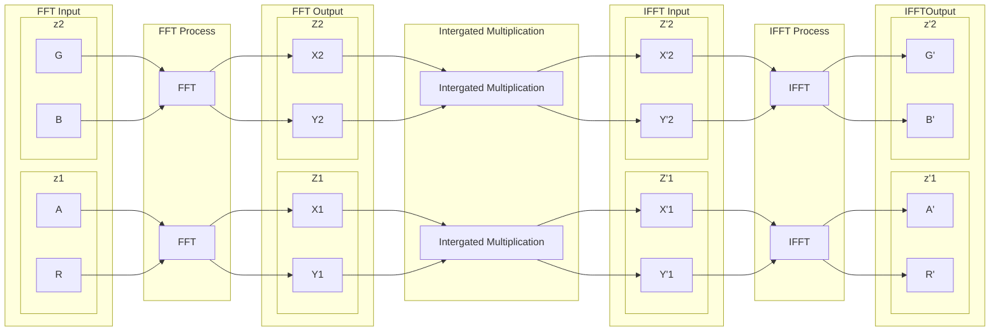

# 综合拓展报告（草稿）

# 摘要

泛光（Bloom）是现代实时渲染中常用的屏幕后处理效果之一，模拟了当光源非常明亮时，透过摄像头或人眼观察时的光晕现象，使高亮区域显得更耀眼。它广泛应用于游戏、电影和虚拟现实中，以增强视觉冲击力和真实感。随着图形硬件的进步，尤其是 GPU 性能的爆发性增长，泛光效果从最早的基于高斯模糊的实现发展至更具表现力的多层次效果，并结合 HDR 渲染技术，生成更真实的高亮场景光晕。高性能、高质量的泛光效果可以在实时渲染中得到广泛应用。降采样技术在泛光效果中起着重要作用，用于减小泛光效果的计算开销，提高性能。降采样技术虽然有效降低了计算开销，但是因为传统降采样技术的局限性，无法提供媲美使用高斯模糊的泛光效果。随着 GPU 可编程渲染管线的发展，复杂的采样技术成为可能。更加先进的降采样算法被相继提出，如 2014 年 Call of Duty 以及 Unreal Engine 4 公布采用了多点降采样技术实现的高质量泛光效果。此方法仍是当今的实时渲染领域主流泛光处理方案。

随着 GPU 图形计算能力的提升和通用计算的发展，更加多样化的泛光效果的实现成为可能， Unreal Engine 4 在 2017 年引入了基于卷积泛光渲染技术，它允许开发者灵活设计不同的光晕图案。通过在频域中设计特定的滤波器，可以生成更加复杂的光晕效果，如星形、十字形、甚至具有独特纹理的光晕，使得泛光效果在视觉上更加多样化和定制化。

卷积在时域（图像的空间域）中的计算复杂度很高，特别是对于大尺寸的卷积核和高分辨率的图像。在这种情况下，直接在空间域进行卷积计算非常耗时，因此通常使用傅里叶变换将卷积转换为频域操作，显著提高计算效率。离散傅里叶变换（DFT）是其中的核心操作，本文旨在利用混合基数 FFT 优化泛光效果的计算效率，探索其在实时渲染中的性能提升与视觉效果表现。

关键词：泛光 图像处理 卷积 离散傅里叶变换 混合基数FFT

# Abstraction

Bloom is one of the commonly used screen post-processing effects in modern real-time rendering. It simulates the halo phenomenon when the light source is very bright and is observed through the camera or human eye, making the highlight area appear more dazzling. It is widely used in games, movies, and virtual reality to enhance visual impact and realism. With the advancement of graphics hardware, especially the explosive growth of GPU performance, the bloom effect has evolved from the earliest Gaussian blur-based implementation to a more expressive multi-level effect, and combined with HDR rendering technology to generate a more realistic halo of highlight scenes. High-performance, high-quality bloom effects can be widely used in real-time rendering. Downsampling technology plays an important role in the bloom effect, which is used to reduce the computational overhead of the bloom effect and improve performance. Although downsampling technology effectively reduces the computational overhead, it cannot provide a bloom effect comparable to that using Gaussian blur due to the limitations of traditional downsampling technology. With the development of GPU programmable rendering pipelines, complex sampling technology has become possible. More advanced downsampling algorithms have been proposed one after another. For example, in 2014, Call of Duty and Unreal Engine 4 first publiced multi-point downsampling technology to achieve high-quality bloom effects. This method is still the mainstream bloom processing solution in the field of real-time rendering today.

With the improvement of GPU graphics computing power and the development of general computing, more diverse bloom effects have become possible. Unreal Engine 4 introduced convolution-based bloom rendering technology in 2017, which allows developers to flexibly design different halo patterns. By designing specific filters in the frequency domain, more complex halo effects can be generated, such as stars, crosses, and even halos with unique textures, making the bloom effect more visually diverse and customized.

The computational complexity of convolution in the time domain (the spatial domain of the image) is very high, especially for large-sized convolution kernels and high-resolution images. In this case, it is very time-consuming to perform convolution calculations directly in the spatial domain, so Fourier transforms are usually used to convert convolutions into frequency domain operations, which significantly improves computational efficiency. Discrete Fourier Transform (DFT) is the core operation. This paper aims to use mixed radix FFT to optimize the computational efficiency of the bloom effect and explore its performance improvement and visual effect in real-time rendering.

Keywords: bloom, image processing, convolution, discrete Fourier transform, mixed radix FFT

1. [综合拓展报告（草稿）](#综合拓展报告草稿)
2. [摘要](#摘要)
3. [Abstraction](#abstraction)
4. [可行性分析](#可行性分析)
   1. [技术可行性](#技术可行性)
      1. [Unity SRP](#unity-srp)
      2. [Compute Shader](#compute-shader)
      3. [混合基数FFT优化原理](#混合基数fft优化原理)
5. [系统实现](#系统实现)
   1. [FFT 四通道卷积](#fft-四通道卷积)
   2. [卷积泛光流程](#卷积泛光流程)
6. [实验](#实验)
   1. [FFT 性能](#fft-性能)
   2. [卷积泛光场景后处理](#卷积泛光场景后处理)
7. [总结体会](#总结体会)
8. [参考文献](#参考文献)

# 可行性分析

## 技术可行性

本课题采用 Unity SRP 进行卷积泛光的集成，采用SPR HLSL Compute Shader 作为 GPU 通用计算的实现方式，实现并行FFT的高效实现策略

### Unity SRP

Unity的Scriptable Render Pipeline（SRP）是一种可编程渲染管线，它允许开发者自定义和控制Unity的渲染流程。SRP与Unity传统的Built-in Render Pipeline相比，提供了更高的灵活性和控制能力，让开发者能够根据项目需求优化渲染效果和性能。SRP允许开发者通过C#脚本自定义渲染流程，这意味着可以编写自己的渲染代码来满足特定的视觉效果和性能需求。可以轻松地添加或修改渲染通道，控制渲染顺序，以及实现特定的渲染效果。通过剔除不必要的渲染步骤，可以优化性能，特别适用于性能受限的平台。通过创建自定义的Shader和渲染特性，开发者可以实现独特的视觉效果。并且Unity集成了图形性能分析工具，可以对渲染过程进行性能分析和监控。

### Compute Shader

Compute Shader是现代图形API（如DirectX 11, DirectX 12, OpenGL 4.3+, Vulkan等）中提供的一种编程模型，它允许开发者利用GPU的并行处理能力来进行非图形渲染的计算任务。在Unity中，Compute Shader可以用于执行各种并行计算，比如物理模拟、图像处理、AI计算、数据并行处理等。Compute Shader 能实现全平台通用的 GPU 并行计算，但是其编程自由度也极大受限，相较于 CUDA 等专业的 GPU 并行计算，Compute Shader更倾向于适应性更强的计算需求。

### 混合基数FFT优化原理

Radix-4 FFT 是 Radix-2 FFT 的常见优化版本。在许多 GPU 实现中，Radix-4 被广泛使用，因为它在减少同步和提高寄存器利用率方面具有较好的平衡。

Radix-8 和 Radix-16 FFT 则进一步提高了每个线程的计算量，但对于这些更大的基数，算法的复杂性也增加了，尤其是在设计有效的蝶形运算和数据调度时，需要进行更复杂的寄存器管理和内存访问优化。

在实现 Radix-N FFT 时，性能优化的关键在于如何高效利用 GPU 的存储层次和并行计算能力。Radix-N FFT 是快速傅里叶变换的一种变种算法，通过选择更大的基数，可以减少 FFT 所需的运算步骤和同步操作。

1. 充分利用寄存器减少内存带宽需求
   寄存器是 GPU 上最快的存储资源。在 FFT 的计算过程中，许多中间计算结果可以直接保存在寄存器中，以避免对共享内存或全局内存的访问。通过优化线程的寄存器使用量，确保所有局部变量能够存储在寄存器中，避免溢出到性能较慢的本地内存。Radix-N FFT 中的每一步计算通常需要多次对输入数据进行变换操作。将这些中间结果尽可能存储在寄存器中，可以显著减少共享内存或全局内存的使用，提升计算效率。

2. 减少 barrier（同步点）的使用
   在并行计算中，线程间的数据交换和同步是不可避免的。在 FFT 中，多个线程需要协作处理不同的频率分量，这常常要求线程间进行同步。然而，频繁的同步会导致 GPU 的性能下降。Radix-N FFT 中，选择更大的基数（如 Radix-4 或 Radix-8）可以显著减少计算步骤，从而减少线程之间需要同步的次数。例如，在传统的 Radix-2 FFT 中，每个步骤后都需要进行一次同步，而 Radix-4 或更高基数的 FFT 可以减少同步频率，因为每个线程在进行多次计算之前无需交换数据。在许多情况下，寄存器可以用于存储线程本地的中间结果，从而减少对共享内存的依赖。这样做不仅能提高数据访问速度，还能减少对线程间同步的需求。通过将计算任务尽可能“局部化”，每个线程可以独立完成更多的工作，减少 barrier 的使用。

基数的选择：基数的选择依赖于具体硬件的架构特性。使用等大的基数时，可提高线程的平均负载，从而提高计算效率，但过大的基数会降低并行度。在 GPU 中，寄存器数量、共享内存容量和内存带宽等都会影响最佳基数的选择。需要通过具体的性能测试来确定最佳基数。

# 系统实现

## FFT 四通道卷积

## 卷积泛光流程

卷积泛光除了卷积外，还涉及到对卷积区域进行预留的，这是因为在 FFT 卷积图像的空域被当作是周期性函数，需要预留空间，以避免泛光效果的“溢出” (Extend & CutOff)
此外因为泛光本身属于低频信息，且高分辨率的卷积操作仍然有极高的计算开销，降低卷积操作的分辨率以提升性能是必要的。这涉及到对原本的图像进行降采样和升采样的操作 (Down-sampling & Up-sampling)。
最后将卷积图案和原图像进行混合(Blend)完成泛光效果

# 实验

## FFT 性能

因为单次FFT的执行时间有所波动

为了使得数据更加方便观察，每一帧进行 $20$ 次的 $FFT$ 与 $IFFT$ ，共 $40$ 次 `ARGBHalf` 四通道($\text{Complex32} \times 2$) 大小 $1024 \times 1024$ 的 $FFT$ 变换，不进行频域信号分离，显卡：`NVIDIA GeForce MX450`

带 `*` 表示进行了内部再分解 

| 组合     | 总用时(ms) | 拷贝用时(ms) | FFT Shader 用时(ms) | 平均FFT+IFFT用时(ms) | 平均单通道FFT用时(ms) |
| -------- | ---------- | ------------ | ------------------- | -------------------- | --------------------- |
| 空Shader | 1.150      | 0.420        | 0.730               | 0.037                | 0.005                 |
| 仅读写   | 13.114     | 0.410        | 12.704              | 0.635                | 0.079                 |
| R2       | 24.037     | 0.409        | 23.628              | 1.181                | 0.148                 |
| R4       | 17.974     | 0.425        | 17.549              | 0.877                | 0.110                 |
| R8+R2    | 18.433     | 0.420        | 18.013              | 0.901                | 0.113                 |
| R16+R4   | 53.338     | 0.407        | 52.931              | 2.647                | 0.331                 |
| R4*      | 17.431     | 0.408        | 17.023              | 0.851                | 0.106                 |
| R8*+R2   | 15.919     | 0.409        | 15.510              | 0.776                | 0.097                 |
| R16*+R4* | 16.034     | 0.409        | 15.625              | 0.781                | 0.098                 |
| R32      | 992.514    | 0.552        | 991.962             | 49.598               | 6.200                 |

```mermaid
gantt
    title Average FFT + IFFT Time (μs)
    dateFormat X
    axisFormat %s
    section Empty
    37   : 0, 37
    section Read Write
    635   : 0, 635
    section R2
    1181   : 0, 1181
    section R4
    877   : 0, 877
    section R8+R2
    901   : 0, 901
    section R16+R4
    2647    : 0, 1181
    section R4*
    851    : 0, 851
    section R8*+R2
    776    : 0, 776
    section R16*+R4*
    781    : 0, 781
```

在1024*1024的场景下，最佳的`R8*+R2`组合平均用时 0.776 ms 而仅读写数据就平均需要 0.635 ms，主要瓶颈是`RWTexture`与`group shared memory`间读写的开销

用表现最好$\text{Radix-8} \times 3 + \text{Radix-2}$ 计算，平均每张`ARGBHalf`大小`1024*1024`贴图的单次FFT时间为 `0.388ms`，平均每通道 `0.097ms` ，是传统的 Cooley-Tukey($\text{Radix-2}$) FFT 算法用时的 66%，核心计算用时是（除去全局内存的读写开销） Cooley-Tukey($\text{Radix-2}$) FFT 算法的 26%

## 卷积泛光场景后处理

# 总结体会

早在1970年代，快速傅里叶变换（FFT）便已经被广泛应用于频域分析，主要用于信号处理和图像处理。然而在图形学领域，FFT的应用主要集中在静态场景中，对实时渲染的优化需求较少。近年来随着游戏和实时图形需求的增加，利用FFT进行实时特效成为了可能。以往的泛光效果渲染在针对特定应用场景的定制化需求也未得到充分满足。由此，通过实现卷积泛光效果，我深入探索了频域卷积方法在GPU上的应用，并最终通过混合基数FFT算法实现了实时高效的定制化泛光效果，提升了渲染效率，丰富了视觉表现。

卷积泛光作为一种高端渲染技术引入了更高的性能开销，但同时也允许了对泛光样式的更精细控制，支持设计者为特定场景定制效果，以适应不同视觉风格的需求。卷积泛光的核心在对卷积操作的优化，FFT方法通过频域操作将复杂的卷积操作转化为点乘，而对FFT算法的优化是卷积操作的核心，本课题使用混合基数的方法针对GPU上的FFT算法进行了优化，混合基数FFT不同于单一的Radix-2 FFT，通过更灵活的因数分解适应不同的数据规模，且其能有效减少同步操作、提高的寄存器利用率、减少内存带宽和复杂存储访问模式需求，这在基于Compute Shader的实现中能够大幅提高性能，为实时应用提供了极大的便利。卷积泛光是一种综合应用，其的实现不仅需要高效的卷积操作，还需要结合传统的泛光技术实现，通过结合传统的分级模糊技术，能使得卷积泛光在性能和视觉效果间进行均衡调整。

在该课题的研究过程中，一方面通过对FFT算法的研究及在计算着色器上的实践，让我对GPU架构及并行算法的设计有了更深理解，并行算法的设计不仅仅要考虑到算法本身的复杂度，还需和和计算架构相结合，优化算法的存储访问、寄存器管理、线程同步、实现更高效的并行计算。另一方面我计算机图形学的理解有了进一步提升，并且让我认识到，传统图形学的很多问题可以通过借鉴信号处理领域的方法来解决，而图形渲染的未来不仅仅是代码的优化，更是如何在架构和技术之间找到平衡，从而达到性能与表现力的最优组合。

# 参考文献

1. Cook R L, Porter T, Carpenter L. Distributed ray tracing[C]//Proceedings of the 11th annual conference on Computer graphics and interactive techniques. 1984: 137-145.

2. Cook R L, Carpenter L, Catmull E. The Reyes image rendering architecture[J]. ACM SIGGRAPH Computer Graphics, 1987, 21(4): 95-102.

3. Govindaraju N K, Lloyd B, Dotsenko Y, et al. High performance discrete Fourier transforms on graphics processors[C]//SC'08: Proceedings of the 2008 ACM/IEEE conference on Supercomputing. IEEE, 2008: 1-12.

4. Real-Time 3D Scene Post-processing [[Chris Oat ATI Research 2003]](https://www.chrisoat.com/papers/Oat-ScenePostprocessing.pdf)

5. The Technology behind the Unreal Engine 4 Elemental Demo [[Martin Mittring Epic 2014]](https://advances.realtimerendering.com/s2012/index.html)

6. An investigation of fast real-time GPU-based image blur algorithms [[Intel 2014]](https://www.intel.com/content/www/us/en/developer/articles/technical/an-investigation-of-fast-real-time-gpu-based-image-blur-algorithms.html)

7. Next Generation Post Processing in Call of Duty: Advanced Warfare [[Jorge Jimenez 2014]](https://www.iryoku.com/next-generation-post-processing-in-call-of-duty-advanced-warfare/)

8. Custom Bloom Post-Process in Unreal Engine [[Froyok 2021]](https://www.froyok.fr/blog/2021-12-ue4-custom-bloom/)

9.  高质量泛光（bloom）从理论到实战 [[AKG4e3 2022]](https://zhuanlan.zhihu.com/p/525500877)

10. CUDA C++ Programming Guide [[Nvidia]](https://docs.nvidia.com/cuda/cuda-c-programming-guide/index.html)
