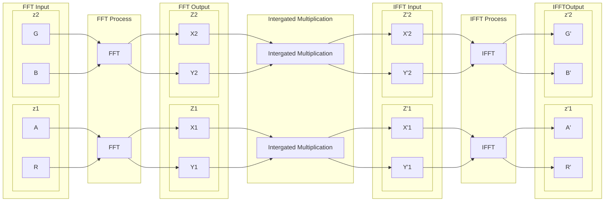

# 综合拓展报告（草稿）

# 摘要

# Abstraction

1. [综合拓展报告（草稿）](#综合拓展报告草稿)
2. [摘要](#摘要)
3. [Abstraction](#abstraction)
4. [可行性分析](#可行性分析)
   1. [技术可行性](#技术可行性)
      1. [Compute Shader](#compute-shader)
      2. [Unity SRP](#unity-srp)
5. [设计计划](#设计计划)
6. [系统详细设计](#系统详细设计)
   1. [并行 FFT 的高效实现策略](#并行-fft-的高效实现策略)
7. [系统实现](#系统实现)
8. [系统测试](#系统测试)
   1. [FFT 性能](#fft-性能)
   2. [泛光场景后处理](#泛光场景后处理)
9. [总结体会](#总结体会)
10. [参考文献](#参考文献)

# 可行性分析

## 技术可行性

### Compute Shader

### Unity SRP

# 设计计划

# 系统详细设计

## 并行 FFT 的高效实现策略

基数选择的影响
Radix-4 FFT 是 Radix-2 FFT 的常见优化版本。在许多 GPU 实现中，Radix-4 被广泛使用，因为它在减少同步和提高寄存器利用率方面具有较好的平衡。

Radix-8 和 Radix-16 FFT 则进一步提高了每个线程的计算量，但对于这些更大的基数，算法的复杂性也增加了，尤其是在设计有效的蝶形运算和数据调度时，需要进行更复杂的寄存器管理和内存访问优化。

基数的选择：基数的选择依赖于具体硬件的架构特性。在现代 GPU 中，寄存器数量、共享内存容量和内存带宽等都会影响最佳基数的选择。通常，基数较大的 FFT 更适合高度并行的 GPU 硬件，特别是当内存带宽成为主要瓶颈时。

在实现 Radix-N FFT 时，性能优化的关键在于如何高效利用 GPU 的存储层次和并行计算能力。Radix-N FFT 是快速傅里叶变换的一种变种算法，通过选择更大的基数，可以减少 FFT 所需的运算步骤和同步操作。

1. 充分利用寄存器
寄存器是 GPU 上最快的存储资源。在 FFT 的计算过程中，许多中间计算结果可以直接保存在寄存器中，以避免对共享内存或全局内存的访问。以下是利用寄存器的一些优化策略：

减少寄存器使用溢出：通过优化线程的寄存器使用量，确保所有局部变量能够存储在寄存器中，避免溢出到性能较慢的本地内存。
临时数据存储：Radix-N FFT 中的每一步计算通常需要多次对输入数据进行变换操作。将这些中间结果尽可能存储在寄存器中，可以显著减少共享内存或全局内存的使用，提升计算效率。
2. 减少 barrier（同步点）的使用
在并行计算中，线程间的数据交换和同步是不可避免的。在 FFT 中，多个线程需要协作处理不同的频率分量，这常常要求线程间进行同步。然而，频繁的同步会导致 GPU 的性能下降。

通过 Radix-N 减少同步：Radix-N FFT 中，选择更大的基数（如 Radix-4 或 Radix-8）可以显著减少计算步骤，从而减少线程之间需要同步的次数。例如，在传统的 Radix-2 FFT 中，每个步骤后都需要进行一次同步，而 Radix-4 或更高基数的 FFT 可以减少同步频率，因为每个线程在进行多次计算之前无需交换数据。

使用寄存器消除同步：在许多情况下，寄存器可以用于存储线程本地的中间结果，从而减少对共享内存的依赖。这样做不仅能提高数据访问速度，还能减少对线程间同步的需求。通过将计算任务尽可能“局部化”，每个线程可以独立完成更多的工作，减少 barrier 的使用。

3. 高效利用共享内存
尽管寄存器是最快的存储单元，但共享内存在需要线程间数据交换时仍然不可避免。共享内存的访问速度比全局内存快得多，但要确保访问模式是“合并的”（coalesced），以减少访问冲突和不必要的延迟。

块内数据共享：在 Radix-N FFT 的实现中，可以将某些中间结果存储在共享内存中，供同一个工作组内的其他线程使用。这样可以减少全局内存的访问量，并使得线程间的数据交换更加高效。

减少共享内存冲突：通过合理分配共享内存，避免不同线程访问共享内存的相同位置（也称为“银行冲突”）。可以通过调整数据访问模式或添加偏移量来减少这些冲突。

4. 合并全局内存访问
在计算过程中，全局内存的访问通常是性能瓶颈，因此应尽量减少对全局内存的访问次数，或者通过合并访问来提高效率。尤其是在大规模 FFT 中，输入数据和结果数据往往存储在全局内存中：

数据预取：通过一次性加载尽可能多的数据到共享内存或寄存器中进行计算，可以减少多次访问全局内存带来的开销。

合并访问：确保全局内存的访问是合并的，即连续的线程访问连续的内存地址，这样可以利用 GPU 内存控制器的带宽优化功能，显著提高全局内存的访问速度。

# 系统实现

# 系统测试

## FFT 性能

因为单次FFT的执行时间有所波动

为了使得数据更加方便观察，每一帧进行 $20$ 次的 $FFT$ 与 $IFFT$ ，共 $40$ 次 `ARGBHalf` 四通道($\text{Complex32} \times 2$) 大小 $1024 \times 1024$ 的 $FFT$ 变换，不进行频域信号分离，显卡：`NVIDIA GeForce MX450`

| 组合     | 总用时(ms) | 拷贝用时(ms) | FFT Shader 用时(ms) | 平均FFT+IFFT用时(ms) | 平均单通道FFT用时(ms) |
| -------- | ---------- | ------------ | ------------------- | -------------------- | --------------------- |
| 空Shader | 1.150      | 0.420        | 0.730               | 0.037                | 0.005                 |
| 仅读写   | 13.114     | 0.410        | 12.704              | 0.635                | 0.079                 |
| R2       | 24.037     | 0.409        | 23.628              | 1.181                | 0.148                 |
| R4       | 17.974     | 0.425        | 17.549              | 0.877                | 0.110                 |
| R8+R2    | 18.433     | 0.420        | 18.013              | 0.901                | 0.113                 |
| R16+R4   | 53.338     | 0.407        | 52.931              | 2.647                | 0.331                 |
| R4*      | 17.431     | 0.408        | 17.023              | 0.851                | 0.106                 |
| R8*+R2   | 15.919     | 0.409        | 15.510              | 0.776                | 0.097                 |
| R16*+R4* | 16.034     | 0.409        | 15.625              | 0.781                | 0.098                 |
| R32      | 992.514    | 0.552        | 991.962             | 49.598               | 6.200                 |

```mermaid
gantt
    title Average FFT + IFFT Time (μs)
    dateFormat X
    axisFormat %s
    section Empty
    37   : 0, 37
    section Read Write
    635   : 0, 635
    section R2
    1181   : 0, 1181
    section R4
    877   : 0, 877
    section R8+R2
    901   : 0, 901
    section R16+R4
    2647    : 0, 1181
    section R4*
    851    : 0, 851
    section R8*+R2
    776    : 0, 776
    section R16*+R4*
    781    : 0, 781
```

在1024*1024的场景下，最佳的`R8*+R2`组合平均用时 0.776 ms 而仅读写数据就平均需要 0.635 ms，目前的瓶颈是`RWTexture`与`group shared memory`间读写的开销

用表现最好$\text{Radix-8} \times 3 + \text{Radix-2}$ 计算，平均每张`ARGBHalf`大小`1024*1024`贴图的单次FFT时间为 `0.388ms`，平均每通道 `0.097ms` 

## 泛光场景后处理

  
  

# 总结体会

# 参考文献

https://www.iryoku.com/next-generation-post-processing-in-call-of-duty-advanced-warfare/

https://www.chrisoat.com/papers/Oat-ScenePostprocessing.pdf